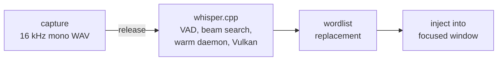

<p align="center">
  
</p>

# sayit

> Push-to-talk dictation for Linux and Windows 11. Hold a key, speak, release — your words are typed into whatever window has focus. 100% local, no cloud, no API keys.

[](https://github.com/MrTorriz/sayit/actions/workflows/ci.yml)
[](LICENSE)
[](#two-platforms-one-repository)
[](#privacy-and-data-at-rest)

<p align="center">
  
</p>

sayit runs [whisper.cpp](https://github.com/ggml-org/whisper.cpp) with Vulkan GPU acceleration and injects the transcribed text into the focused window — terminal, editor, browser, anything. It ships tuned for Swedish via [KB-Whisper](https://huggingface.co/KBLab/kb-whisper-medium), the National Library of Sweden's Whisper fine-tune, which beats OpenAI's `whisper-large-v3` on every Swedish benchmark at a fraction of the size ([KBLab's numbers](https://huggingface.co/KBLab/kb-whisper-medium): 47% lower WER on average for `kb-whisper-large`, ~38% for the default `medium`). It works with any GGML Whisper model and language.



The pipeline above is the whole product, and it is the same on both platforms. Only
the first and the last stage are platform code: how the microphone is opened, and how
the finished text reaches the focused window.

## Highlights

|                     |                                                                                    |
| ------------------- | ---------------------------------------------------------------------------------- |
| **Local**           | No cloud service, no API key, no telemetry — audio never leaves your machine       |
| **Fast**            | Vulkan GPU inference + a warm model daemon ([measured](#performance))              |
| **Works anywhere**  | Layout-independent text injection — terminals, editors, browsers; Wayland and X11 on Linux |
| **Push-to-talk**    | Hold-to-talk on a mouse thumb button and toggle on a hotkey, with a live voice meter and a recording indicator |
| **Learns your vocabulary** | Teach it your terms: `sayit-learn "get hub" "GitHub"`                        |
| **Measurable**      | Built-in stats and per-stage latency profiling on both platforms; a reproducible benchmark harness on Linux |
| **Bluetooth-aware** | On Linux, auto-switches headsets (e.g. AirPods) to their mic profile and back. Windows does that switch itself |

## Why sayit

- **Nothing leaves your machine.** Unlike cloud dictation services there is no account, no audio upload, no word quota and no subscription — the model runs on your own GPU or CPU, and works offline.
- **Native to the platform, not a port of one to the other.** The Linux side speaks PipeWire, systemd and Wayland — including KWin/Plasma, where most injection tricks fail. The Windows side is Windows PowerShell 5.1 plus small C# helpers and nothing else: no runtime to install, no package manager, no Python.
- **No wake word, no idle cost.** Push-to-talk with a real button: the microphone is only open while you hold it, and nothing runs between dictations except an idle warm model.
- **Small enough to audit.** A handful of scripts, one `.env`, a test suite per platform. No Electron, no framework.

## Two platforms, one repository

The two implementations share everything except code:

| Shared | Where |
|---|---|
| Model handling | The same pinned whisper.cpp release (`v1.9.2`), the same GGML model and Silero VAD files, the same daemon-first contract: try the warm `whisper-server` on `127.0.0.1`, fall back to `whisper-cli` **only** on a transport failure |
| Wordlist format | `original<TAB>replacement`, sorted longest original first, applied sequentially, case-insensitive on word boundaries, literal strings — the same contract in `bin/sayit-wordlist` and `win\sayit-wordlist.ps1` |
| History format | `history.jsonl`, one JSON object per line with `time`, `seconds`, `words`, `text` — a history file is portable between the two |
| Settings | One `.env`, created from the shared `.env.example`, same names and same meanings wherever a setting exists on both |
| Documentation and identity | This README, [docs/ARCHITECTURE.md](docs/ARCHITECTURE.md), the mark and its geometry |

The code is not shared, and there is nothing to share: bash, PipeWire and ydotool on
one side, PowerShell, `waveIn` and `SendInput` on the other. Where the two diverge:

| Stage | Linux (`bin/`) | Windows (`win\`) |
|---|---|---|
| Capture | `pw-record` (PipeWire) | `waveIn` through `win\lib\Recorder.cs` |
| Stopping a recording | `SIGINT`, then poll until the recorder has exited | a named event; the recorder finalises its own RIFF header |
| Trigger | Solaar rules (mouse) or a desktop global shortcut | `WH_KEYBOARD_LL` / `WH_MOUSE_LL` in `win\sayit-trigger.ps1` |
| Injection | clipboard + `Shift+Insert` (`ydotool`), with `wtype`/`xdotool` fallbacks | `SendInput` with `KEYEVENTF_UNICODE`; clipboard + `Ctrl+V` above a length threshold |
| Indicator / meter | a persistent notification plus a separate meter that opens its own capture stream | one layered click-through window, fed by the level the recorder already computes |
| Warm model | a systemd user service | `win\sayit-autostart.ps1` starts it, itself started by a scheduled task at logon, or `win\sayit-daemon.ps1 start` by hand |
| Keeping the trigger alive | systemd `Restart=` | `win\sayit-autostart.ps1` restarts it in seconds; the task's repeating trigger restarts the supervisor within a minute |
| Bluetooth | `bin/sayit-bt` switches A2DP to HFP and back | none: Windows selects HFP itself when an application opens a capture endpoint |
| Transient state | `$XDG_RUNTIME_DIR` (RAM-backed tmpfs) | `%LOCALAPPDATA%\sayit\run` (on disk, cleaned up explicitly) |

The reasoning behind each divergence is in [docs/ARCHITECTURE.md](docs/ARCHITECTURE.md).

## Linux

### Requirements

- Any Linux distribution with PipeWire (tested on Fedora KDE/Wayland; `install.sh` knows the package names for Fedora, Debian/Ubuntu and Arch)
- A Vulkan-capable GPU (recommended) or CPU fallback
- Python 3 and Perl (present on virtually every distro)

`install.sh` checks and offers to install everything else: `cmake`, a C++ toolchain, `git`, `curl`, PipeWire tools, `ydotool`, `wl-clipboard`, `jq`, `libnotify`, and the Vulkan development packages. Optional: `wtype` (injection fallback on wlroots compositors) and `espeak-ng` (used by the smoke test and the benchmark). On KWin/Wayland the `ydotoold` service needs a one-time setup — see [Text injection on KWin/Wayland](#text-injection-on-kwinwayland-ydotool).

### Installation

```bash
git clone https://github.com/MrTorriz/sayit.git
cd sayit
./install.sh                 # interactive
./install.sh -y              # answer yes to everything
./install.sh --model large   # best accuracy (default: medium)
./install.sh --help          # all flags
```

What `install.sh` does:

1. Verifies system packages (dnf/apt/pacman; prints a manual list elsewhere)
2. Clones and builds whisper.cpp at a **pinned release** in `~/.local/src/whisper.cpp` (Vulkan when available, CPU-only otherwise)
3. Symlinks `whisper-cli` → `~/.local/bin/whisper-cli`
4. Downloads the KB-Whisper model (q5_0) → `models/` and **verifies its sha256** against the published upstream checksum
5. Downloads the Silero VAD model (~1 MB), also checksum-verified
6. Creates `.env` from `.env.example` and seeds `~/.config/sayit/wordlist.tsv`

| Flag              | Effect                                          |
| ----------------- | ----------------------------------------------- |
| `-y`, `--yes`     | Answer yes to all prompts                       |
| `--model SIZE`    | Model size: `small` \| `medium` \| `large`      |
| `--rebuild`       | Re-fetch and rebuild whisper.cpp at the pinned release |
| `--skip-packages` | Skip the system package check                   |
| `--skip-build`    | Skip the whisper.cpp build                      |
| `--skip-model`    | Skip the model downloads                        |
| `-h`, `--help`    | Show help and exit                              |

#### Upgrading and rollback

Re-running `./install.sh` is always safe: it never overwrites an existing `.env` (it reports settings your `.env` is missing), never re-downloads present models, and skips the build. To upgrade whisper.cpp to the release pinned in the script:

```bash
./install.sh --rebuild
```

To roll back or pin a different revision: `WHISPER_REF=<tag-or-commit> ./install.sh --rebuild`. The built revision is recorded in `~/.local/src/whisper.cpp/.sayit-build-info`.

### Usage

#### Mouse button via Solaar (hold-to-talk, recommended)

Turn a Logitech mouse thumb button into push-to-talk via [Solaar](https://github.com/pwr-Solaar/Solaar): hold the button = record, release = transcribe + paste. Example in [`config/solaar-rules.example.yaml`](config/solaar-rules.example.yaml).

1. Divert the button (Solaar GUI: device → button → "Diverted", or set the control ID to `1` under `divert-keys` in `~/.config/solaar/config.yaml`). On the MX Master 3S, the large thumb plate ("Mouse Gesture Button") is control ID `195`.
2. Copy the example to `~/.config/solaar/rules.yaml` (fix the paths), restart Solaar.
3. The rules run `sayit start` on press and `sayit stop` on release.

> [!TIP]
> On Bluetooth microphones (e.g. AirPods), the profile switch typically takes around a second (up to ~2.5 s) before the mic is live. Wait for the recording indicator (or the "Recording" notification) before you start speaking — recording starts only once the microphone is actually capturing.

#### Global hotkey (toggle)

Bind `bin/sayit` to any free key. On KDE: System Settings → Shortcuts → Custom Shortcuts (see [`config/kglobalshortcuts.example`](config/kglobalshortcuts.example) and the [`config/sayit.desktop`](config/sayit.desktop) template). Other desktops: any mechanism that runs a command on a keypress works.

1. Press the key → recording starts (indicator + notification shown)
2. Speak
3. Press again → stops, transcribes, pastes into the focused window

#### Recording indicator and live meter

While the microphone is live, sayit shows two pieces of feedback:

- **A live voice meter** — the sayit mark itself is the meter: its bars follow your voice level and the dot burns red while the microphone is open, so you can see that dictation hears you. By default it is drawn as a small pill of sayit's own above your other windows (`RECORDING_METER_STYLE="overlay"`); clicks pass straight through it, so it can never be in the way. Put it wherever you like:

  ```bash
  ./bin/sayit-overlay --place    # drag the pill, Enter or Escape saves
  ```

  The position is remembered in `~/.config/sayit/overlay-position`.

- **A persistent notification** as the recording indicator; it appears when capture actually starts (after any Bluetooth profile switch) and is removed on stop, cancel and failure.

The two are independent: `RECORDING_METER=0` turns off the meter, `RECORDING_INDICATOR=0` the notification.

The meter opens its own low-rate PipeWire stream (the recording is unaffected) and uses the audio only to compute a level — nothing is stored. It has three styles, each falling back to the next when its requirements are missing, so it degrades instead of disappearing:

| `RECORDING_METER_STYLE` | What you get | Needs |
|---|---|---|
| `overlay` (default) | sayit's own pill, freely positionable, click-through | Wayland with layer-shell, plus the GTK bindings `install.sh` lists as optional |
| `mark` | the animated mark in Plasma's on-screen display | Plasma OSD + the theme icons `install.sh` installs |
| `wave` | a scrolling bar waveform in the same OSD | Plasma OSD |

The notification and the OSD styles use the sayit theme icons (light/dark variants following the desktop color scheme) and fall back to a generic microphone icon without them.

#### Manual

```bash
./bin/sayit-transcribe recording.wav  # → text on stdout
./bin/sayit                           # toggle (same as the hotkey)
./bin/sayit start                     # hold-mode: start on key press
./bin/sayit stop                      # hold-mode: stop on key release
./bin/sayit cancel                    # discard the current recording
./bin/sayit doctor                    # read-only check of the recording path
./bin/test-pipeline                   # smoke test with a synthetic voice
```

#### Text injection on KWin/Wayland (ydotool)

KWin (Plasma 6) does **not** expose the virtual-keyboard protocol, causing `wtype` to fail with `Compositor does not support the virtual keyboard protocol`. Use `ydotool` (uinput) instead.

<details>
<summary><b>KWin/Wayland setup instructions</b></summary>

The `ydotoold` daemon must be running with its socket accessible to your user. Set up a systemd override:

```bash
sudo mkdir -p /etc/systemd/system/ydotool.service.d
sudo tee /etc/systemd/system/ydotool.service.d/override.conf >/dev/null <<EOF
[Service]
ExecStart=
ExecStart=/usr/bin/ydotoold --socket-path=/run/.ydotool_socket --socket-perm=0660 --socket-own=$(id -u):$(id -g)
EOF
sudo systemctl daemon-reload
sudo systemctl enable --now ydotool.service
```

> [!NOTE]
> `sayit-inject` reads `YDOTOOL_SOCKET` (defaulting to `/run/.ydotool_socket`) and falls back automatically to `wtype` (wlroots) or `xdotool` (X11) depending on your session. Be aware that a user-accessible uinput socket lets **any** process running as your user synthesize input system-wide — an inherent trade-off of this approach on KWin.

</details>

> [!IMPORTANT]
> **Why clipboard pasting on Linux?** Synthetic typing tools (`ydotool type`) send US-layout keycodes, which drops or mangles non-ASCII characters (`å/ä/ö`) on other layouts. sayit instead copies the text to the clipboard and sends a single `Shift+Insert` — exact for every language and toolkit. Your previous clipboard is restored afterwards (see [Privacy and data at rest](#privacy-and-data-at-rest) for the exact rules). Windows does not need this workaround; see [its injection notes](#text-injection-windows).

#### History and statistics

```bash
./bin/sayit-history              # latest 20 transcriptions
./bin/sayit-history 50           # latest 50
./bin/sayit-history --stat       # words, speaking WPM, time saved vs typing
./bin/sayit-history --stat 7d    # same, limited to a period (Nd/Nh/Nm)
./bin/sayit-history --copy 175   # copy entry 175 to the clipboard
./bin/sayit-history --inject 175 # re-inject entry 175 into the focused window
./bin/sayit-history --clear      # empty the history
```

<p align="center">
  
</p>

History lives in `~/.local/share/sayit/history.jsonl` (one JSON line per entry). The listing shows each entry's **absolute line number**, so the same N works directly with `--copy` and `--inject`. Corrupt lines (e.g. after a crash mid-write) are skipped with a warning — they never take the rest of the history down.

`--stat` estimates **time saved** by comparing your speaking time against how long the same number of words would take to type at `TYPING_WPM` words/min (default 40, adjustable in `.env`):

<p align="center">
  
</p>

#### Bluetooth headsets

Bluetooth headphones (AirPods and friends) normally sit in the A2DP profile for high-quality playback — which exposes **no microphone**. `sayit` therefore switches the connected headset to its headset profile (HSP/HFP) when recording starts, records from its mic, and switches back on stop. Handled by `bin/sayit-bt`, no manual steps needed.

```bash
./bin/sayit-bt up     # -> headset profile, prints the source name
./bin/sayit-bt down   # -> restore the previous profile
```

- The headset is picked dynamically from the default output, so multiple headsets work without configuration.
- The headset profile degrades **playback** to phone quality (mSBC, 16 kHz mono) while recording — restored immediately on stop.
- With no Bluetooth headset connected, `sayit-bt` is a no-op and recording uses `AUDIO_SOURCE`/the PipeWire default mic.
- The profile switch is synchronous and typically takes around a second (up to ~2.5 s) — recording (and the indicator) starts once the mic is actually live, so wait for the indicator before speaking.
- **With a dedicated microphone, set `AUDIO_SOURCE`.** sayit then records straight from it and never touches the headset, so playback stays in A2DP throughout — no switch, no delay, no quality drop. `./bin/sayit doctor` confirms which of the two paths your configuration selects.

This whole stage exists only on Linux. Windows selects HFP automatically when an application opens a capture endpoint.

### Daemon mode (lower latency)

Keeps the model warm in RAM via `whisper-server` (local HTTP on 127.0.0.1:9876):

```bash
cp config/systemd/sayit-daemon.service ~/.config/systemd/user/
# edit the two paths in the service file to your clone location, then:
systemctl --user daemon-reload
systemctl --user enable --now sayit-daemon.service
```

The service runs `bin/sayit-daemon`, which sources `.env` and starts `whisper-server` with the right model, VAD, flash attention and beam settings. Change the model or VAD in `.env` and `systemctl --user restart sayit-daemon.service` — no service-file editing needed.

`bin/sayit-transcribe` uses the server automatically when it responds (POST to `http://127.0.0.1:9876/inference`) and falls back to `whisper-cli` on transport errors. With the warm daemon the per-dictation model load disappears — see the measured numbers below. Note that `whisper-cli` and the model file are only needed for the fallback path; a healthy daemon serves on its own.

### Troubleshooting

| Problem                                       | Fix                                                                                     |
| --------------------------------------------- | --------------------------------------------------------------------------------------- |
| `pw-record: command not found`                | Install your distro's PipeWire tools (`pipewire-utils` / `pipewire-bin` / `pipewire`)   |
| Vulkan errors during the build                | Install the Vulkan headers, loader and `glslc`, or accept the CPU-only build            |
| "Transcription failed: …" notification        | The error class is in the notification; details in `$XDG_RUNTIME_DIR/sayit-last-error.log` |
| Empty result                                  | Verify the mic: `pw-record --rate 16000 -c 1 -F s16 test.wav` (Ctrl+C, `paplay test.wav`) |
| High latency                                  | Switch to the `small` model or enable the daemon                                        |
| Text does not appear                          | On KWin `wtype` fails (no virtual-keyboard protocol) — set up `ydotool.service`, see above |
| `Compositor does not support the virtual keyboard protocol` | You are on KWin/Wayland — use the ydotool injection path (see Usage) |
| "Injection failed" notification               | `systemctl status ydotool` + `ls -l /run/.ydotool_socket` (must be owned by your user); the text is recoverable with `sayit-history --inject` |
| `Model missing` from `sayit-transcribe`       | Run `./install.sh` (or `--skip-packages --skip-build` if only the model is missing)     |
| whisper.cpp broken after an OS upgrade        | `./install.sh --rebuild`                                                                |
| No notifications                              | Install `libnotify` (`notify-send`)                                                     |
| Recording indicator never disappears          | `./bin/sayit-indicator hide` removes it manually                                        |
| No meter at all while recording               | Check `RECORDING_METER` in `.env`; `./bin/sayit-overlay --check` reports whether the overlay style can run here |
| Meter falls back to the Plasma OSD instead of the pill | The overlay needs a Wayland session with layer-shell plus `python3-gobject`, GTK 3 and `gtk-layer-shell` — see the optional packages in `install.sh` |
| Meter shows a waveform or a generic icon instead of the mark | Install the theme icons: `./install.sh --skip-packages --skip-build --skip-model` |
| The pill sits in the wrong place              | `./bin/sayit-overlay --place`, drag it, then press Enter                                |
| Recording starts but never stops              | Check `$XDG_RUNTIME_DIR/sayit.session` — it must name a live `pw-record` process        |
| Anything wrong with the recording path        | `./bin/sayit doctor` — read-only; resolves the source sayit will actually record from, reports the Bluetooth profile and any leftover state |
| `AUDIO_SOURCE` stopped working after a reboot | You configured a numeric PipeWire id; use the node name from `pactl list sources short` — `./bin/sayit doctor` says so explicitly |
| The USB mic is plugged in but has no source   | Its card is in an output-only profile — `./bin/sayit doctor` prints the `pactl set-card-profile` line that fixes it, whether the source is named by `AUDIO_SOURCE` or reached as the PipeWire default |
| Bluetooth headset records from the wrong mic  | Verify the headset is connected; try `./bin/sayit-bt up` (should print `bluez_input.…`) |
| Headset stuck in phone-quality audio          | Run `./bin/sayit-bt down` to force A2DP back after an abnormally aborted recording      |
| Solaar button does not trigger dictation      | Run `systemctl --user status solaar.service` and verify Solaar is running in your graphical session. |

Run `./bin/test-pipeline` for an end-to-end check with a synthetic voice (no microphone needed).

## Windows 11

### Requirements

To run sayit, nothing needs to be installed: Windows PowerShell 5.1, .NET Framework
4.8.1, WinForms and the in-box C# compiler all ship in Windows 11, and the small C#
helpers in `win\lib\` are compiled at runtime by `Add-Type`. There is no third-party
runtime, no NuGet package and no Python on the Windows side.

To build whisper.cpp you need:

- `git`
- CMake
- Visual Studio Build Tools with the C++ workload (the `VC.Tools.x86.x64` component)
- The LunarG Vulkan SDK — optional, but without it the build is CPU-only, which is
  [dramatically slower](#windows-reference-machine)

`win\install.ps1` checks for each of these and prints the `winget` command and the
download URL for whatever is missing. It installs nothing without being told to.

> [!IMPORTANT]
> There is no official prebuilt Vulkan binary of whisper.cpp for Windows, so GPU
> acceleration means building from source. Integrated-GPU support only arrived in
> whisper.cpp v1.8.3, so older third-party "Vulkan" builds silently run on the CPU.
> `win\install.ps1` pins `v1.9.2`, the same release `install.sh` builds on Linux.

Running the Windows test suite additionally needs Pester 5 or newer; Windows ships
Pester 3.4.0, which `win\tests\Invoke-Tests.ps1` refuses to run under.

### Installation

```powershell
git clone https://github.com/MrTorriz/sayit.git
cd sayit
.\win\install.ps1                        # interactive
.\win\install.ps1 -Yes                   # answer yes to every prompt
.\win\install.ps1 -Rebuild               # rebuild at the pinned tag
.\win\install.ps1 -SkipBuild -SkipModel  # only .env, wordlist and autostart
```

What `win\install.ps1` does, in order:

1. Checks `git`, CMake, the MSVC C++ build tools and the Vulkan SDK, and reports what is missing together with a `winget` command or a URL
2. Clones and builds whisper.cpp at the pinned reference into `%LOCALAPPDATA%\sayit\whisper.cpp`, configuring `-DGGML_VULKAN=ON` when the Vulkan SDK is present (`build-vulkan\`) and a CPU build otherwise (`build-cpu\`), recording what it built in `.sayit-build-info`
3. Verifies that the model files are present in the repo's `models\` directory and prints their sha256 against the published checksums
4. Creates `.env` from `.env.example` when there is none; an existing `.env` is never overwritten, and the settings it lacks are listed instead
5. Seeds the wordlist from `config\wordlist.example.tsv` when there is none
6. Offers to register a scheduled task named `sayit` that starts `win\sayit-autostart.ps1`
   at logon and keeps it running. If a task from an earlier version is already there, it
   lists what is wrong with it and offers to replace it

| Flag           | Effect                                                            |
| -------------- | ----------------------------------------------------------------- |
| `-Yes`         | Answer yes to every prompt                                        |
| `-Rebuild`     | Fetch and rebuild whisper.cpp at the pinned reference             |
| `-SkipBuild`   | Do not build whisper.cpp; only report the build tools             |
| `-SkipModel`   | Do not check the model files                                      |
| `-NoAutostart` | Do not offer to register the logon task                           |

Two things the installer leaves for you to finish:

- **The models are not downloaded.** `win\install.ps1` only checks that they are there
  and prints their sha256. Put `ggml-kb-whisper-medium-q5_0.bin` and
  `ggml-silero-v5.1.2.bin` in the repo's `models\` directory, or point `MODEL_PATH` and
  `VAD_MODEL` at them elsewhere. They are the same files `install.sh` fetches on Linux,
  from [KBLab/kb-whisper-medium](https://huggingface.co/KBLab/kb-whisper-medium)
  (`ggml-model-q5_0.bin`) and [ggml-org/whisper-vad](https://huggingface.co/ggml-org/whisper-vad).
- **`WHISPER_CLI` and `WHISPER_SERVER` are rewritten for you.** Their defaults in
  `.env.example` are Linux paths, so when `install.ps1` creates `.env` it replaces both
  with the build it produced, as `%LOCALAPPDATA%`-relative values. An existing `.env` is
  never rewritten; if yours predates this and still holds the Linux paths, set them
  yourself. `.\win\sayit-doctor.ps1` tells you whether the two paths resolve.

Re-running the installer is safe: an existing build, `.env` and wordlist are left alone,
and so is a scheduled task that is already current. A task that is not — one from a
version before the supervisor, or one whose settings would keep it from starting — is
listed with its shortcomings and replaced only if you say yes. Replacing it stops the
running trigger and starts it again straight away, and the installer reports the pid it
ended up with. Remove the task with
`Unregister-ScheduledTask -TaskName 'sayit' -Confirm:$false`.

### Usage

#### Push-to-talk trigger

`win\sayit-trigger.ps1` holds a global low-level hook and runs `sayit.ps1 start` on
press, `sayit.ps1 stop` on release:

```powershell
.\win\sayit-trigger.ps1                  # arm the trigger; hold to talk
.\win\sayit-trigger.ps1 -Probe           # print every button and key transition
.\win\sayit-trigger.ps1 -Probe -Seconds 20
.\win\sayit-trigger.ps1 -Button VK124    # override TRIGGER_BUTTON for this run
```

`TRIGGER_BUTTON` accepts `XBUTTON1` and `XBUTTON2` (the mouse side buttons), `MIDDLE`
(the wheel click), or `VK` followed by a virtual-key code, e.g. `VK124` for F13.
`-Probe` binds nothing and suppresses nothing — it only reports what your hardware
actually emits, which is the reliable way to find the code a given mouse sends.

> [!IMPORTANT]
> **Some mice never let the button reach Windows.** A thumb button that the mouse
> diverts in firmware produces no event at all until the vendor utility maps it to a
> real button (for example to a side button or to F13). This is the Windows counterpart
> of Solaar's divert on Linux, and it is a required setup step on such hardware, not an
> edge case. If `-Probe` shows nothing when you press the button, map it in the vendor
> utility first.
>
> A second case has its own tool: some devices — notably Logitech mice paired over
> Bluetooth LE and driven by the in-box HID driver — report their thumb buttons as HID
> consumer-control usages rather than as mouse buttons, which a low-level mouse hook
> cannot see at all. `.\win\sayit-rawprobe.ps1` uses Raw Input to show those. Note that
> Raw Input can observe such a button but cannot suppress it.

`TRIGGER_SUPPRESS=1` (the default) swallows the trigger so the focused application never
sees it — without it, binding a thumb button would also navigate the app back or forward
on every dictation.

#### Autostart and the warm daemon

`win\install.ps1` offers a scheduled task named `sayit`. It runs one action at logon —
`win\sayit-autostart.ps1` — and that script is what keeps sayit alive for the rest of the
session:

- it starts the warm daemon **without waiting for it**, so the model loads while the
  push-to-talk button is already armed. As two task actions they ran strictly in sequence
  and the button stayed dead for as long as the model took to load
- it runs `sayit-trigger.ps1` again whenever it exits, after a two-second pause that
  doubles up to a minute if the trigger keeps failing immediately
- it also restarts a trigger that is still running but has stopped answering. The
  trigger writes a heartbeat every five seconds from the same loop that pumps the
  messages its hook rides on, and 90 seconds of silence from that loop is a wedge, not
  a slow machine. A process being alive is not the same as the button working
- it refuses to run twice, and it never starts a second trigger while one already holds
  the hook. Two hooks on the same button start and stop the dictation twice per press,
  which is worse than having none

Both guards are named mutexes rather than pid files, so Windows releases them when the
process dies however it dies, and there is no stale file to clean up.

The task carries two triggers. **At logon**, which covers a cold boot, a restart, a
fast-startup (hybrid shutdown) boot and logging off and back on, because every one of
them ends in a logon. And a **time trigger that repeats every minute**, which is what
brings the supervisor back if the supervisor itself dies. While it is alive those repeats
are refused by the task's `IgnoreNew` policy and recorded as `LastTaskResult 0x800710E0`;
that is this task's normal state, not a failure.

There is deliberately no at-startup trigger. It would run as `SYSTEM` in session 0, where
an input hook reaches no desktop and injected text reaches no window — and it would need
administrator rights to register. Nothing can arm the push-to-talk button before someone
logs in.

`.\win\sayit-doctor.ps1` reports the whole chain under **Autostart**: whether the task is
registered and enabled, what its last result was and what that result means, whether the
supervisor and the trigger are running, and whether the daemon answers.

None of it needs the task or administrator rights. `.\win\sayit-autostart.ps1` from a
shell does the same job for as long as that shell lives. Elevation would make the tool
worse, not better: an elevated trigger cannot type into the non-elevated windows you
spend the day in.

To drive the daemon by hand:

```powershell
.\win\sayit-daemon.ps1 start    # start it if it is not already running
.\win\sayit-daemon.ps1 status   # report whether it answers
.\win\sayit-daemon.ps1 stop     # stop it
.\win\sayit-daemon.ps1 run      # run it in the foreground
```

It serves `whisper-server` on `127.0.0.1` at `DAEMON_PORT` with no authentication, so
any local process can reach it — keep it on loopback. The model, the VAD model, threads
and beam size are fixed when the server starts; change them in `.env` and restart it.
Language, initial prompt and the four VAD tuning settings (`VAD_SPEECH_PAD_MS`,
`VAD_THRESHOLD`, `VAD_MIN_SPEECH_MS`, `VAD_MIN_SILENCE_MS`) are sent with each request,
so those take effect on the next dictation with no restart.

`win\sayit-transcribe.ps1` tries the daemon first and falls back to `whisper-cli` **only
on a transport failure**; an empty response from a healthy daemon means "no speech" and
is final. Same contract as the Linux side.

#### Recording indicator

`RECORDING_INDICATOR=1` (the default) shows sayit's mark as a small pill above your
other windows while the microphone is open: the bars follow your voice level and the
full stop burns red. It uses the same geometry as [`docs/logo.svg`](docs/logo.svg) and
the `icons/sayit-level-*.svg` frames.

```powershell
.\win\sayit-indicator.ps1 place   # drag it where you want it, Enter or Escape saves
.\win\sayit-indicator.ps1 hide    # tell a running indicator to close
```

The position is remembered in `%APPDATA%\sayit\overlay-position`. The window is layered,
click-through and never activating (`WS_EX_LAYERED`, `WS_EX_TOOLWINDOW`,
`WS_EX_TRANSPARENT`, `WS_EX_NOACTIVATE`, shown with `SW_SHOWNOACTIVATE`), so it never
steals the focus you are dictating into and clicks pass straight through it. The level
comes from the recorder, which has already computed it, so the microphone is opened only
once — unlike the Linux meter, which opens a second capture stream.

`INDICATOR_SCALE` resizes it — the pill and the mark inside it scale together.

By default the pill is excluded from screen captures, screen shares and recordings
(`INDICATOR_EXCLUDE_FROM_CAPTURE=1`), so a shared screen does not show that you are
dictating. You still see it; the capture does not. This needs Windows 10 2004 or later —
on an older build the request is refused and the pill is captured as usual. Set it to `0`
if you are recording a demo and want the pill in the video.

Two limits are architectural and no setting changes them: the indicator cannot appear
over a true exclusive-fullscreen application, nor on the UAC secure desktop.

#### Manual

```powershell
.\win\sayit.ps1                     # toggle
.\win\sayit.ps1 start               # hold-mode: on button press
.\win\sayit.ps1 stop                # hold-mode: on button release
.\win\sayit.ps1 cancel              # discard the current recording
.\win\sayit.ps1 doctor              # read-only check of the recording path
.\win\sayit-doctor.ps1 -Quiet       # only warnings, failures and the summary
.\win\sayit-transcribe.ps1 rec.wav  # -> text on stdout
.\win\sayit-record.ps1 -List        # list capture devices with their endpoint IDs
.\win\sayit-inject.ps1 "text"       # deliver text to the focused window
```

`AUDIO_SOURCE` is empty by default, which records from the Windows default capture
device. To pin one microphone, put its **MMDevice endpoint ID** there — when your driver
reports one. `waveInMessage` is documented to return an endpoint ID per device, and some
drivers return nothing at all; on the machine this port was developed on, every capture
device came back with an empty endpoint ID. Then the friendly name is the only key you
have, and the API truncates it at 31 characters and it changes when the device is renamed
or reconnected. `sayit-record.ps1 -List` and `sayit-doctor.ps1` print what your devices
actually expose, and the doctor says which of the two selectors you are left with.

There is a case no setting can fix: a virtual capture device — a headset vendor's audio
suite, for instance — can be the only capture endpoint Windows exposes, with the physical
microphone behind it not presented as an endpoint at all. `AUDIO_SOURCE` can then only
name the virtual device, and which physical microphone feeds it is decided in that
vendor's own software, not here.

`MAX_RECORD_SECONDS` (default 120) bounds how long the microphone can stay open if
whatever started the recording dies before stopping it.

#### Text injection (Windows)

Short text is typed with `SendInput` using `KEYEVENTF_UNICODE`, which sends the
character itself rather than a scan code. That is layout independent by construction, so
Swedish characters need no clipboard workaround here — unlike the Linux side, where
`ydotool` sends US scan codes.

Text longer than `INJECT_CLIPBOARD_THRESHOLD` (default 100 characters) goes through the
clipboard plus `Ctrl+V` instead, for two Windows-specific reasons: the OS caps
`SendInput` near 5000 characters, and it loses its ordering guarantee whenever another
process holds a low-level keyboard hook — sayit's own trigger always is one.
`INJECT_METHOD` overrides the choice: `type` always types, `clipboard` always pastes,
`auto` (the default) decides by length.

When the clipboard is used, the text is marked with
`ExcludeClipboardContentFromMonitorProcessing`, `CanIncludeInClipboardHistory=0` and
`CanUploadToCloudClipboard=0`, so a dictation stays out of Win+V history and out of cloud
sync.

When the focused window runs at a higher integrity level, no synthetic input can reach
it, and Windows reports no error for that — the failure would be invisible. sayit detects
the case up front, leaves the text on the clipboard and tells you to press `Ctrl+V`.

#### History and statistics

```powershell
.\win\sayit-history.ps1                 # latest 20 transcriptions
.\win\sayit-history.ps1 50              # latest 50
.\win\sayit-history.ps1 -Stat           # words, speaking WPM, time saved vs typing
.\win\sayit-history.ps1 -Stat -Period 7d
.\win\sayit-history.ps1 -Copy 175       # copy entry 175 to the clipboard
.\win\sayit-history.ps1 -Inject 175     # re-inject entry 175 into the focused window
.\win\sayit-history.ps1 -Clear          # empty the history
```

History lives in `%LOCALAPPDATA%\sayit\history.jsonl`, in the same format as on Linux.
Numbering is the absolute 1-based line number, so the same N works with `-Copy` and
`-Inject`. Corrupt lines are skipped and counted; the count goes to stderr, never the
content.

### Troubleshooting

| Problem | Fix |
| --- | --- |
| Anything wrong with the recording path | `.\win\sayit-doctor.ps1` — read-only; it resolves `AUDIO_SOURCE`, reports the backend, the daemon, leftover sessions and orphaned recorders |
| `whisper-cli missing` / `whisper-server missing` naming a `$HOME/...` path | Your `.env` still holds the Linux defaults — set `WHISPER_CLI` and `WHISPER_SERVER` to the built binaries, or remove the two lines |
| The trigger button does nothing | `.\win\sayit-trigger.ps1 -Probe`. No event at all usually means the mouse diverts the button in firmware — map it in the vendor utility. If it is a Bluetooth LE Logitech mouse, try `.\win\sayit-rawprobe.ps1` |
| The trigger stops working after a while | The OS silently removes a hook that runs too slowly; the trigger re-arms itself every 30 s. If it stays dead, restart `sayit-trigger.ps1` |
| Text does not appear, and nothing failed | The focused window runs elevated — the text is on the clipboard, press `Ctrl+V` |
| Nothing at all is transcribed, and `-List` shows the mic | `.\win\sayit-doctor.ps1`; a digitally silent capture is reported distinctly (exit code 2 from `sayit-record.ps1`) |
| Transcription is slow | Check for `ggml-vulkan.dll` beside the binaries; without it the build is CPU-only. Install the Vulkan SDK and re-run `.\win\install.ps1 -Rebuild` |
| Every dictation reloads the model | Nothing answers on `127.0.0.1:DAEMON_PORT` — `.\win\sayit-daemon.ps1 start` |
| The indicator is invisible in a game | It cannot appear over an exclusive-fullscreen application, nor on the UAC secure desktop |
| The indicator sits in the wrong place | `.\win\sayit-indicator.ps1 place`, drag it, press Enter |
| Recording starts but never stops | `.\win\sayit-doctor.ps1` reports stale sessions and orphaned recorders and prints the command to clear them; a recorder also stops by itself at `MAX_RECORD_SECONDS` |
| Non-ASCII characters come out mangled | Use the scripts as they are; each entry point sets UTF-8 output itself. A wrapper that re-encodes stdout will corrupt them |
| `Should -Be` behaves strangely when running the tests | You are on the in-box Pester 3.4.0 — `Install-Module Pester -Scope CurrentUser -Force -SkipPublisherCheck` |

## Custom wordlist

Fix recurring mistranscriptions with a TSV of replacements. The file, the format and the
matching rules are identical on both platforms; only the path differs
(`~/.config/sayit/wordlist.tsv` on Linux, `%APPDATA%\sayit\wordlist.tsv` on Windows, or
`WORDLIST` in `.env`):

```text
get hub	GitHub
docker komposse	docker-compose
```

Format: `original<TAB>replacement`. Applied case-insensitively on word boundaries after transcription, with longer originals tried first — so multi-word rules win over substrings regardless of line order. Rules are applied sequentially, so a replacement can itself be matched by a later, shorter rule. Lines starting with `#` are comments. Originals are literal strings, never regexes.

Faster: teach sayit directly from mistakes with `sayit-learn` (grows the wordlist, deduped):

```bash
./bin/sayit-learn "gitting nore" "gitignore"   # add
./bin/sayit-learn --list                       # show all
./bin/sayit-learn --undo "gitting nore"        # remove
```

```powershell
.\win\sayit-learn.ps1 "gitting nore" "gitignore"
.\win\sayit-learn.ps1 -List
.\win\sayit-learn.ps1 -Undo "gitting nore"
```

## Configuration

Everything lives in `.env`, created from [`.env.example`](.env.example) by whichever
installer you ran. Both platforms read the same file; settings that exist on only one of
them are ignored by the other.

| Variable          | Default                          | Platform | Purpose                                             |
| ----------------- | -------------------------------- | -------- | --------------------------------------------------- |
| `MODEL_PATH`      | `models/ggml-kb-whisper-medium…` | both     | GGML model file (empty = repo default)              |
| `WHISPER_CLI`     | (see `.env.example`)             | both     | `whisper-cli` binary. The template holds the Linux path; `win\install.ps1` rewrites it when it creates `.env` |
| `WHISPER_SERVER`  | (see `.env.example`)             | both     | `whisper-server` binary. Same rewrite as above      |
| `SPEECH_LANGUAGE` | `sv`                             | both     | ISO 639-1 language code passed to whisper           |
| `AUDIO_SOURCE`    | (empty)                          | both     | Recording device. Linux: PipeWire node name; empty = headset mic / PipeWire default. Windows: endpoint ID when the driver reports one, otherwise the device name (exact or substring); empty = the Windows default capture device. `sayit-doctor.ps1` prints what your devices actually expose |
| `THREADS`         | `8`                              | both     | CPU threads for the CLI fallback                    |
| `BEAM`            | `5`                              | both     | Beam search size (`-1` = greedy)                    |
| `VAD_MODEL`       | `models/ggml-silero-v5.1.2.bin`  | both     | Silero VAD; point at a missing file to disable      |
| `VAD_SPEECH_PAD_MS` | `250`                          | both  | Audio kept after the detected end of speech, in ms. The only one of these four that lengthens the tail; whisper.cpp's own default of `30` clips Swedish unvoiced finals |
| `VAD_THRESHOLD`   | `0.30`                           | both  | Speech probability above which Silero calls a 32 ms frame speech (whisper.cpp: `0.5`) |
| `VAD_MIN_SPEECH_MS` | `0`                            | both  | Segments shorter than this are discarded. `0` discards nothing: if every segment goes, transcription returns success with an empty result and no error |
| `VAD_MIN_SILENCE_MS` | `300`                         | both  | Silence needed before a segment is closed. Does **not** lengthen the tail, however high it is set |
| `INITIAL_PROMPT`  | (empty)                          | both     | One short natural sentence of context, not a term list — see [Accuracy](#accuracy-vad-beam-search-initial-prompt-suppression) for why |
| `SUPPRESS_REGEX`  | (empty)                          | both     | Regex for stubborn hallucinated phrases. Windows: applied to the text on both paths, never passed to `whisper-server`, which has no such option |
| `DAEMON_PORT`     | `9876`                           | both     | Port for the warm whisper-server                    |
| `LLM_CLEANUP`     | `0`                              | Linux    | `1` = LLM post-cleanup pass (needs GPU); **sends the transcribed text to `LLM_URL`** |
| `LLM_URL`         | `http://127.0.0.1:11434/api/generate` | Linux | Endpoint for that pass. Loopback = nothing leaves the machine; anything else does |
| `LLM_MODEL`       | `gemma2:2b`                      | Linux    | Model name passed to that endpoint                  |
| `TYPING_WPM`      | `40`                             | both     | Assumed typing speed for the time-saved statistic   |
| `WORDLIST`        | (empty = platform default)       | both     | Replacement wordlist (grown by `sayit-learn`)       |
| `RECORDING_INDICATOR` | `1`                          | both     | Linux: the persistent notification. Windows: the on-screen pill. `0` = off |
| `RECORDING_METER` | `1`                              | Linux    | Live microphone meter; `0` = off                    |
| `RECORDING_METER_STYLE` | `overlay`                  | Linux    | `overlay` = sayit's own pill; `mark` = animated mark in the Plasma OSD; `wave` = waveform in the OSD |
| `TRIGGER_BUTTON`  | `XBUTTON2`                       | Windows  | Push-to-talk button: `XBUTTON1`, `XBUTTON2`, `MIDDLE`, or `VK<code>` |
| `TRIGGER_SUPPRESS` | `1`                             | Windows  | Swallow the trigger so the focused application never sees it; `0` = let it through |
| `INJECT_METHOD`   | `auto`                           | Windows  | `auto` = type short text and paste longer text; `type`; `clipboard` |
| `INJECT_CLIPBOARD_THRESHOLD` | `100`                 | Windows  | Length in characters above which `auto` switches from typing to pasting |
| `MAX_RECORD_SECONDS` | `120`                         | Windows  | Hard cap on a single recording, in seconds          |
| `INDICATOR_SCALE` | `1.0`                            | Windows  | Size of the on-screen pill; `1.0` is 100x52 px. Values outside `0.5`-`4.0` fall back to `1.0` |
| `INDICATOR_EXCLUDE_FROM_CAPTURE` | `1`               | Windows  | Keep the pill out of screen captures, screen shares and recordings. Needs Windows 10 2004 or later; older builds capture it anyway. `0` = let it be captured |

`SPEECH_LANGUAGE`, `INITIAL_PROMPT` and the four `VAD_*` tuning settings
apply per dictation. `THREADS`, `BEAM` and `VAD_MODEL` apply immediately to the CLI
fallback but are fixed at server start for the daemon — restart it after changing them
(`systemctl --user restart sayit-daemon.service` on Linux, `.\win\sayit-daemon.ps1 stop`
then `start` on Windows). On Linux, `SUPPRESS_REGEX` always applies to the CLI fallback
and is forwarded to the daemon only when the installed `whisper-server` build supports
the flag. On Windows it is never passed to the server at all — `whisper-server` has no
such option, and being given one makes it exit at startup — so it is applied to the text
of whichever path served the dictation.

The Windows scripts read `.env` as plain `KEY=VALUE` data rather than executing it, so a
value there is never run as code. They expand `%VAR%` in values; they do not expand
`$HOME` or other shell syntax.

### Accuracy: VAD, beam search, initial prompt, suppression

Several settings raise quality (all on by default):

- **VAD (`VAD_MODEL`)** — Silero Voice Activity Detection filters out non-speech before the model sees the audio. Whisper hallucinates (ghost text, repeated phrases) on silence; VAD removes that risk at the edges of every recording. Four further settings decide where it cuts, and only one of them does what people expect: `VAD_SPEECH_PAD_MS` is the only setting that lengthens the tail of a phrase, because whisper.cpp ends a segment at the first 32 ms frame whose speech probability falls below `VAD_THRESHOLD` − 0.15 and adds back only that padding. `VAD_MIN_SILENCE_MS` does not extend the tail however high it is set, and `VAD_MIN_SPEECH_MS` is a correctness setting rather than a quality one: anything shorter is discarded, and when every segment is discarded the transcription still succeeds — with an empty result and no error.
- **Beam search (`BEAM`)** — `5` decodes more accurately than greedy (`-1`).
- **Suppress non-speech (`-sns`)** — the daemon and CLI always suppress non-speech tokens (`[music]`, brackets, noise). An optional `SUPPRESS_REGEX` additionally removes specific recurring junk strings. On Windows it is applied to the transcribed text on both paths, and the CLI fallback also suppresses matching tokens while decoding. It is never passed to `whisper-server`, which has no `--suppress-regex` option at all: that binary answers an unknown option by printing its usage and exiting with status 0, so passing one made the warm daemon quit at startup while looking like a clean shutdown.
- **Initial prompt (`INITIAL_PROMPT`)** — empty by default, and a term list is the wrong thing to put in it. Whisper treats the slot as the transcript of the preceding segment, not as a vocabulary: across 11 datasets, biasing-word prompts cut rare-word errors from 23.7% to 18.0% but made overall WER **worse** on 6 of them, and worse still as the list grew from 35 to 70 to 150 words ([arXiv:2502.11572](https://arxiv.org/abs/2502.11572)). A dictation is a handful of words, so a long prompt leaves the decoder holding far more prior text than audio — the regime where the model is reported to emit the prompt itself as the transcript. If you use it, use one short natural sentence in your dictation language, around 25 tokens, carrying a few domain nouns in context, and leave rare-term correction to the wordlist, which is deterministic. whisper.cpp truncates the prompt to 224 tokens (`n_text_ctx / 2`) from the tail, and a `max_context` of 0 disables the initial prompt entirely — the two sit behind the same guard.
- **Flash attention (`-fa`)** — always on; speeds up inference on GPU.

Optional and Linux-only: **LLM cleanup (`LLM_CLEANUP=1`)** fixes spelling, split words and obvious errors with context. It POSTs the transcribed text to `LLM_URL`, which defaults to a local Ollama — the only configuration in which the text stays on your machine. Worth the latency only with a GPU-accelerated Ollama: on CPU it is too slow (~15 s) and a small model can make technical terms worse, so it is **off by default**.

### Choosing a model size

WER (lower = better) from [KBLab's benchmarks](https://huggingface.co/KBLab/kb-whisper-medium) for Swedish, compared with OpenAI whisper-large-v3:

| Size                          | File (q5_0) | RAM    | Speed   | WER (FLEURS / CommonVoice / NST) |
| ----------------------------- | ----------- | ------ | ------- | -------------------------------- |
| `kb-whisper-small`            | 175 MB      | low    | fastest | 7.3 / 6.4 / 6.6                  |
| `kb-whisper-medium` (default) | 539 MB      | medium | fast    | 6.6 / 5.4 / 5.8                  |
| `kb-whisper-large`            | 1.1 GB      | high   | slower  | **5.4 / 4.1 / 5.2**              |
| OpenAI whisper-large-v3       | —           | high   | slower  | 7.8 / 9.5 / 11.3                 |

`large` makes ~10–24% fewer errors than `medium` depending on the test set (mean ~18%). What it costs in latency **has not been measured on the Windows side**, and by architecture it should be a real cost rather than a rounding error: `large` runs 32 layers at 1280 state against `medium`'s 24 at 1024, roughly 2.1× the encoder compute, and an integrated GPU sharing system memory is bandwidth-bound, which lands near the same ratio. Treat that figure as arithmetic, not as a benchmark, and time it on your own machine before switching.

```bash
./install.sh --model large     # or small
# point MODEL_PATH in .env at the new file, then restart the daemon:
systemctl --user restart sayit-daemon.service
```

On Windows, put the model file in `models\` yourself, point `MODEL_PATH` at it and
restart the daemon.

For languages other than Swedish: download any GGML Whisper model (e.g. from [ggml-org](https://huggingface.co/ggerganov/whisper.cpp)), set `MODEL_PATH` and `SPEECH_LANGUAGE`.

## Performance

### Linux reference machine

Measured with the bundled harness ([`tests/benchmark.sh`](tests/benchmark.sh)) — Intel Core Ultra 9 185H, Intel Arc iGPU via Vulkan, Fedora 44, `kb-whisper-medium` q5_0 + Silero VAD, 2026-08-20. Wall time around `sayit-transcribe` (transcription incl. normalization and wordlist), synthetic 16 kHz Swedish test audio, 25 repetitions per warm speech scenario (10 for silence and the cold fallback):

| Scenario (audio length)                    |  n | median |   p95 |   max |
| ------------------------------------------ | -: | -----: | ----: | ----: |
| Warm daemon — short sentence (2.2 s)       | 25 | 1.62 s | 1.64 s | 1.64 s |
| Warm daemon — medium (8.7 s)               | 25 | 3.12 s | 3.28 s | 3.41 s |
| Warm daemon — long (20.8 s)                | 25 | 6.41 s | 6.67 s | 6.74 s |
| Warm daemon — silence (2.0 s)              | 10 | 0.06 s | 0.09 s | 0.09 s |
| Cold `whisper-cli` fallback — short        | 10 | 2.65 s | 2.71 s | 2.71 s |
| Cold `whisper-cli` fallback — medium       | 10 | 4.27 s | 4.37 s | 4.37 s |
| Daemon model load (service start)          |  1 | 0.95 s |     — |     — |

The warm daemon saves roughly a second per dictation versus the cold fallback. A silent recording returns in ~0.06 s — an empty answer from the daemon is final and never triggers a redundant cold re-run. Profiling overhead with `SAYIT_PROFILE=1` is below 1%. A deliberately wedged server (SIGSTOP) is capped by the audio-scaled request deadline and completes via the CLI fallback in ~15 s instead of hanging.

End-to-end "release to text" adds recorder shutdown, Bluetooth profile restore and clipboard injection on top of the warm figures — typically a few hundred milliseconds (estimate). On Bluetooth headsets, the A2DP→HFP profile switch before recording starts adds roughly 0.5–2.5 s of preparation at **press** time (estimate, not yet measured) — the recording indicator shows when the mic is actually live.

Reproduce it yourself:

```bash
BENCH_MODEL=models/ggml-kb-whisper-medium-q5_0.bin ./tests/benchmark.sh
```

### Windows reference machine

The bats harness does not run on Windows. These numbers come from whisper.cpp's own
`whisper-bench` and from sayit's per-stage profiling, on the reference machine — Intel
Core Ultra 9 185H, Intel Arc integrated graphics, Windows 11 build 26200,
`kb-whisper-medium` q5_0 with Silero VAD, 2026-08-22.

Encode time, three repetitions interleaved with cooldowns:

| Backend | run 1 | run 2 | run 3 | median |
| --- | ---: | ---: | ---: | ---: |
| Vulkan on the Arc integrated GPU | 723.7 ms | 676.0 ms | 957.7 ms | **723.7 ms** |
| CPU with OpenBLAS, 6 threads | 8953.0 ms | 9888.4 ms | 10340.4 ms | **9888.4 ms** |

Vulkan is about 13.7x faster on encode. Decode per step: 16.1–21.0 ms on Vulkan against
29.8–33.9 ms on CPU. Worth noting: the CPU figures degrade monotonically across the three
runs as the laptop heats up, while the Vulkan figures stay flat.

End to end, from releasing the button to the text appearing, three dictations with
`SAYIT_PROFILE=1`:

| Dictation | 1 | 2 | 3 | median |
| --- | ---: | ---: | ---: | ---: |
| Release to text | 2.37 s | 4.81 s | 2.47 s | **2.47 s** |

Per stage across those three: the daemon round trip took 1.18–2.90 s, wordlist
replacement 0.02 s, injection 0.18 s and stopping the recorder about 0.2 s. Daemon model
load at service start: 2.63 s.

Per-stage latency profiling of real dictations is built in on both platforms: set
`SAYIT_PROFILE=1` and read `$XDG_RUNTIME_DIR/sayit-profile.csv` on Linux or
`%LOCALAPPDATA%\sayit\run\sayit-profile.csv` on Windows (run id, timestamps and stage
names only — never dictated text).

## Privacy and data at rest

Speech recognition always runs locally, and audio never leaves the machine. There is no telemetry and no account. One optional feature is the exception: `LLM_CLEANUP=1` (Linux only) POSTs the transcribed text to `LLM_URL` — off by default, and pointed at a local Ollama (`127.0.0.1`) when you do turn it on. Point `LLM_URL` at another host and your dictated text goes there in plain HTTP.

What *does* exist on your machine:

- **Audio** lives only in `$XDG_RUNTIME_DIR` (RAM-backed tmpfs) on Linux and in `%LOCALAPPDATA%\sayit\run` on Windows during a dictation, and is deleted right after transcription. Windows has no tmpfs equivalent, so that directory is on disk; `sayit.ps1` also sweeps WAV files older than an hour when the next recording starts, and `sayit-doctor.ps1` reports any that are left.
- **History**: every dictation's text is appended to `~/.local/share/sayit/history.jsonl` (Linux) or `%LOCALAPPDATA%\sayit\history.jsonl` (Windows) and kept until you clear it. If a backup or sync tool sweeps that directory, your dictations follow it — exclude it if that matters to you.
- **Clipboard**: on Linux the text always transits the clipboard during injection, so clipboard managers (Klipper, CopyQ, …) may archive it under their own retention rules; sayit restores your previous clipboard ~1 s after pasting — but only if you haven't copied something new meanwhile — and clears the primary selection. Non-text clipboards (images) and clipboards tagged by password managers are never read, saved or re-offered. On Windows the clipboard is used only above `INJECT_CLIPBOARD_THRESHOLD` or when typing is impossible, the text is marked to stay out of Win+V history and cloud sync, and the previous clipboard contents are **not** restored.
- **Notifications**: on Linux they show the first characters of a dictation and are sent as transient (not retained in the notification history on compliant servers). The Windows side sends no notifications; its only feedback is the on-screen pill, which shows a level and never text.
- **Diagnostics**: failures append error classes (never text or audio) to `$XDG_RUNTIME_DIR/sayit-last-error.log`, which vanishes at logout, or to `%LOCALAPPDATA%\sayit\run\sayit-last-error.log`, which does not — delete it yourself if you want it gone.
- The warm `whisper-server` listens on `127.0.0.1` only, with no authentication — any local process can reach it. Keep it on loopback.
- `.\win\sayit-doctor.ps1` never prints `.env`, and prints only whether `INITIAL_PROMPT` and `SUPPRESS_REGEX` are set, because both hold text you wrote.

See [SECURITY.md](SECURITY.md) for the security model and how to report issues.

## Project structure

```text
sayit/
├── install.sh                          # Linux setup (packages, pinned build, checksummed models, .env)
├── LICENSE                             # MIT
├── SECURITY.md                         # security model + private reporting
├── CONTRIBUTING.md                     # dev setup, style rules, PR checklist
├── .env.example                        # configuration template, shared, with a Windows-only section
├── .gitattributes
├── .gitignore
├── .github/                            # CI (Linux and Windows jobs), issue/PR templates
├── docs/
│   ├── ARCHITECTURE.md                 # what is shared, where the platforms diverge, and why
│   ├── logo.svg                        # project mark (theme-aware SVG)
│   ├── demo.gif                        # the hold-to-talk flow, shown at the top of this README
│   ├── make-demo.py                    # generator for that animation
│   ├── history_list.png                # screenshot: sayit-history list view
│   └── history_stat.png                # screenshot: sayit-history statistics view
├── bin/                                # Linux implementation (bash, plus one Python file)
│   ├── sayit                           # session state machine: record + transcribe + inject
│   ├── sayit-bt                        # Bluetooth headset A2DP <-> headset-mic switching
│   ├── sayit-doctor                    # read-only diagnostics for the recording path
│   ├── sayit-record                    # pw-record → 16 kHz mono WAV
│   ├── sayit-transcribe                # daemon-first whisper + VAD + prompt + (LLM) + wordlist
│   ├── sayit-daemon                    # wrapper: whisper-server with .env flags
│   ├── sayit-inject                    # wl-copy + Shift+Insert / ydotool / wtype / xdotool
│   ├── sayit-indicator                 # persistent recording indicator (notification-based)
│   ├── sayit-meter                     # live voice meter: picks a style and owns the capture
│   ├── sayit-overlay                   # the overlay style: sayit's own click-through pill (Python)
│   ├── sayit-history                   # history & statistics (time saved)
│   ├── sayit-learn                     # self-growing wordlist (learn from mistakes)
│   ├── sayit-wordlist                  # wordlist replacement engine (perl)
│   └── test-pipeline                   # smoke test with espeak-ng
├── win/                                # Windows implementation (PowerShell 5.1 + runtime-compiled C#)
│   ├── install.ps1                     # prerequisites, pinned build, model check, .env, logon task
│   ├── sayit.ps1                       # session state machine: record + transcribe + inject
│   ├── sayit-autostart.ps1             # the logon task's one action: warm daemon + supervised trigger
│   ├── sayit-trigger.ps1               # global push-to-talk hook, with -Probe
│   ├── sayit-rawprobe.ps1              # Raw Input diagnostic for HID consumer-control buttons
│   ├── sayit-record.ps1                # waveIn → 16 kHz mono WAV, stopped by a named event
│   ├── sayit-transcribe.ps1            # daemon-first whisper + VAD + prompt + wordlist
│   ├── sayit-daemon.ps1                # whisper-server: start/stop/status/run
│   ├── sayit-inject.ps1                # SendInput Unicode / clipboard + Ctrl+V front end
│   ├── sayit-indicator.ps1             # the on-screen pill: show/hide/place
│   ├── sayit-doctor.ps1                # read-only diagnostics for the recording path
│   ├── sayit-history.ps1               # history & statistics (time saved)
│   ├── sayit-learn.ps1                 # self-growing wordlist
│   ├── sayit-wordlist.ps1              # wordlist replacement engine (front end)
│   ├── lib/
│   │   ├── common.ps1                  # paths, .env reader, UTF-8 IO, profiling, wordlist engine
│   │   ├── inject.ps1                  # shared injection logic, dot-sourced in-process
│   │   ├── Recorder.cs                 # waveIn capture, RIFF writer, level publishing
│   │   ├── Trigger.cs                  # WH_KEYBOARD_LL / WH_MOUSE_LL hooks
│   │   ├── Injector.cs                 # SendInput, clipboard, integrity-level check
│   │   └── RawInput.cs                 # Raw Input observation for the diagnostic probe
│   └── tests/
│       ├── Invoke-Tests.ps1            # runner; requires Pester 5+
│       ├── DotEnv.Tests.ps1
│       ├── Recorder.Tests.ps1
│       ├── Utf8.Tests.ps1
│       └── Wordlist.Tests.ps1
├── icons/                              # theme icons: notification mark + OSD meter levels (light/dark)
├── config/
│   ├── wordlist.example.tsv            # starter wordlist (seeded by both installers)
│   ├── sayit.desktop                   # KDE application entry template
│   ├── kglobalshortcuts.example        # example KDE global shortcut
│   ├── solaar-rules.example.yaml       # example mouse-button hold-to-talk
│   └── systemd/sayit-daemon.service    # daemon mode (whisper-server)
├── tests/                              # bats test suite + benchmark harness (Linux)
└── models/                             # GGML models + Silero VAD (gitignored)
```

## Design notes

- **Why clipboard injection on Linux, and typing on Windows?** `ydotool type` sends US-layout keycodes, so any non-ASCII character breaks; clipboard + `Shift+Insert` is exact for every language and toolkit, and the previous clipboard is restored afterwards. `SendInput` with `KEYEVENTF_UNICODE` sends the character itself, so Windows needs no such workaround — until the text is long enough to hit the OS cap, which is when it pastes instead.
- **Why per-session state?** Each recording gets its own WAV and an atomically claimed session file, so overlapping press/release events, double taps and back-to-back dictations can never kill the wrong process or read a half-written file. Both implementations do this; the Windows side additionally stops the recorder by signalling a named event, so the recorder finalises its own RIFF header.
- **Why a wordlist + initial prompt instead of fine-tuning?** Recurring mistranscriptions are highly personal (project names, brand names). A TSV file and a decoder prompt fix most of them with zero training cost, and `sayit-learn` makes adding a rule a two-second operation.
- **Why push-to-talk instead of a wake word?** Deliberate scope: push-to-talk is more reliable, more private, and has no idle CPU cost.
- **Why one repository for two implementations?** The parts worth keeping identical — the model contract, the wordlist, the history format, the settings — are exactly the parts that are not code.

A deeper walkthrough — both pipelines, the components, the latency profile and the
reasoning behind each design decision — lives in [docs/ARCHITECTURE.md](docs/ARCHITECTURE.md).

## Contributing

Bug reports, fixes and focused features are welcome — see
[CONTRIBUTING.md](CONTRIBUTING.md) for the dev setup, style rules and the
pre-PR checklist.

CI runs three jobs: `bash -n` plus `shellcheck` over `bin/`, `install.sh` and the shell
files in `tests/`; the [Bats](https://github.com/bats-core/bats-core) suite; and a
Windows job that parses every `win\*.ps1`, compiles the C# helpers with `Add-Type`, runs
PSScriptAnalyzer and executes the Pester suite. The Linux jobs glob `bin/`, `install.sh`,
`tests/*.sh` and `docs/*.py` only, so the Windows implementation cannot break them, and
the Windows job covers `win/` and nothing else.

Note that the workflow triggers only on pushes to `main` and on pull requests, so a
feature branch gets no run of its own — open the pull request to get one.

## License

MIT — see [LICENSE](LICENSE).
