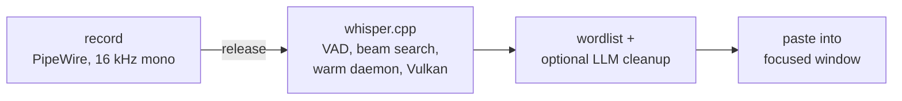
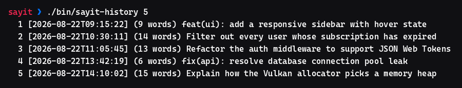
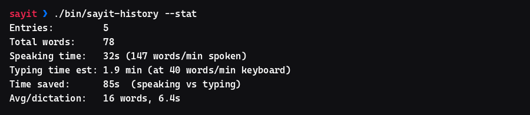

# sayit

> Push-to-talk dictation for Linux. Hold a key, speak, release — your words are typed into whatever window has focus. 100% local, no cloud, no API keys.

[](https://github.com/MrTorriz/sayit/actions/workflows/ci.yml)
[](LICENSE)
[](#requirements)
[](#design-notes)

<p align="center">
  
</p>

sayit runs [whisper.cpp](https://github.com/ggml-org/whisper.cpp) with Vulkan GPU acceleration and injects the transcribed text into the focused window — terminal, editor, browser, anything. It ships tuned for Swedish via [KB-Whisper](https://huggingface.co/KBLab/kb-whisper-medium) (the National Library of Sweden's Whisper fine-tune, 47% lower WER than `whisper-large-v3` on Swedish), but works with any GGML Whisper model and language.



## Highlights

|                     |                                                                                    |
| ------------------- | ---------------------------------------------------------------------------------- |
| **Local**           | No cloud service, no API key, no telemetry — audio never leaves your machine       |
| **Fast**            | Vulkan GPU inference + a warm model daemon: ~1.3 s for a short sentence            |
| **Works anywhere**  | Layout-independent text injection — terminals, editors, browsers, Wayland and X11  |
| **Push-to-talk**    | Toggle (hotkey) and hold-to-talk (mouse button via Solaar) modes                   |
| **Self-improving**  | Teach it your vocabulary: `sayit-learn "get hub" "GitHub"`                       |
| **Measurable**      | Built-in stats: words dictated, speaking WPM, and time saved vs typing             |
| **Bluetooth-aware** | Auto-switches headsets (e.g. AirPods) to their mic profile and back                |

## Use cases

General-purpose dictation, tuned for software engineering workflows:

- **Git commits** — dictate commit messages straight into the terminal (e.g. `feat(ui): add responsive sidebar layout`)
- **Documentation** — dictate code comments, docstrings and architecture notes while keeping your eyes on the code
- **Chat & prompts** — dictate prompts and long messages into CLI tools and web chat apps; speaking is roughly 3x faster than typing
- **RSI prevention & accessibility** — dictate long emails, chat messages and design documents hands-free

## Requirements

- Any Linux distribution with PipeWire (tested on Fedora KDE/Wayland; `install.sh` knows the package names for Fedora, Debian/Ubuntu and Arch)
- A Vulkan-capable GPU (recommended) or CPU fallback
- Python 3 and Perl (present on virtually every distro)

`install.sh` checks and offers to install everything else: `cmake`, a C++ toolchain, `git`, PipeWire tools, `ydotool`, `wl-clipboard`, `jq`, `libnotify`, and the Vulkan development packages. Optional: `wtype` (injection fallback on wlroots compositors) and `espeak-ng` (used by the smoke test).

### Text injection on KWin/Wayland (ydotool)

KWin (Plasma 6) does **not** expose the virtual-keyboard protocol, causing `wtype` to fail with `Compositor does not support the virtual keyboard protocol`. Use `ydotool` (uinput) instead.

<details>
<summary><b>🔧 Click here for KWin/Wayland setup instructions</b></summary>

The `ydotoold` daemon must be running with its socket accessible to your user. Set up a systemd override:

```bash
sudo mkdir -p /etc/systemd/system/ydotool.service.d
sudo tee /etc/systemd/system/ydotool.service.d/override.conf >/dev/null <<'EOF'
[Service]
ExecStart=
ExecStart=/usr/bin/ydotoold --socket-path=/run/.ydotool_socket --socket-perm=0660 --socket-own=1000:1000
EOF
sudo systemctl daemon-reload
sudo systemctl enable --now ydotool.service
```

> [!NOTE]
> Replace `1000:1000` with your active UID/GID (`id -u`:`id -g`) if they differ. `sayit-inject` reads `YDOTOOL_SOCKET` (defaulting to `/run/.ydotool_socket`) and falls back automatically to `wtype` (wlroots) or `xdotool` (X11) depending on your session.

</details>

> [!IMPORTANT]
> **Layout Independence (Non-ASCII Characters):**
> Traditional synthetic typing tools (`ydotool type`) send keycodes according to the US layout. This drops or mangles non-ASCII characters (`å/ä/ö`, symbols) on other layouts. To fix this, `sayit` injects text by copying it to the clipboard, sending `Shift+Insert` to paste it instantly, and automatically restoring your previous clipboard content (at bytes level) ~1 second later. This ensures exact, layout-independent pasting across terminals, editors, and browsers.

## Installation

```bash
git clone https://github.com/MrTorriz/sayit.git
cd sayit
./install.sh                 # interactive
./install.sh -y              # answer yes to everything
./install.sh --model large   # best accuracy (default: medium)
./install.sh --help          # all flags
```

What `install.sh` does:

1. Verifies system packages (dnf/apt/pacman; prints a manual list elsewhere)
2. Clones and builds whisper.cpp in `~/.local/src/whisper.cpp` (Vulkan when available, CPU-only otherwise)
3. Symlinks `whisper-cli` → `~/.local/bin/whisper-cli`
4. Downloads the KB-Whisper model (q5_0) → `models/`
5. Downloads the Silero VAD model (~1 MB) → `models/`
6. Creates `.env` from `.env.example` and seeds `~/.config/sayit/wordlist.tsv`

| Flag              | Effect                                          |
| ----------------- | ----------------------------------------------- |
| `-y`, `--yes`     | Answer yes to all prompts                       |
| `--model SIZE`    | Model size: `small` \| `medium` \| `large`      |
| `--skip-packages` | Skip the system package check                   |
| `--skip-build`    | Skip the whisper.cpp build                      |
| `--skip-model`    | Skip the model downloads                        |
| `-h`, `--help`    | Show help and exit                              |

## Usage

### Mouse button via Solaar (hold-to-talk, recommended)

Turn a Logitech mouse thumb button into push-to-talk via [Solaar](https://github.com/pwr-Solaar/Solaar): hold the button = record, release = transcribe + paste. Example in [`config/solaar-rules.example.yaml`](config/solaar-rules.example.yaml).

1. Divert the button (Solaar GUI: device → button → "Diverted", or set the control ID to `1` under `divert-keys` in `~/.config/solaar/config.yaml`). On the MX Master 3S, the large thumb plate ("Mouse Gesture Button") is control ID `195`.
2. Copy the example to `~/.config/solaar/rules.yaml` (fix the paths), restart Solaar.
3. The rules run `sayit start` on press and `sayit stop` on release.

> [!TIP]
> On Bluetooth microphones (e.g. AirPods), the mic takes about 1 second to wake up. It is recommended to hold the button for a brief moment before you start speaking. `sayit` includes a race guard so that a very quick press-and-release does not lose or corrupt the recording.


### Global hotkey (toggle)

Bind `bin/sayit` to any free key. On KDE: System Settings → Shortcuts → Custom Shortcuts (see [`config/kglobalshortcuts.example`](config/kglobalshortcuts.example) and the [`config/sayit.desktop`](config/sayit.desktop) template). Other desktops: any mechanism that runs a command on a keypress works.

1. Press the key → recording starts (notification shown)
2. Speak
3. Press again → stops, transcribes, pastes into the focused window

### Manual

```bash
./bin/sayit-transcribe recording.wav  # → text on stdout
./bin/sayit                           # toggle (same as the hotkey)
./bin/sayit start                     # hold-mode: start on key press
./bin/sayit stop                      # hold-mode: stop on key release
./bin/sayit cancel                    # discard the current recording
./bin/test-pipeline                     # smoke test with a synthetic voice
```

### History and statistics

```bash
./bin/sayit-history              # latest 20 transcriptions
./bin/sayit-history 50           # latest 50
./bin/sayit-history --stat       # words, speaking WPM, time saved vs typing
./bin/sayit-history --stat 7d    # same, limited to a period (Nd/Nh/Nm)
./bin/sayit-history --copy 175   # copy entry 175 to the clipboard
./bin/sayit-history --inject 175 # re-inject entry 175 into the focused window
./bin/sayit-history --clear      # empty the history
```

<p align="center">
  
</p>

History lives in `~/.local/share/sayit/history.jsonl` (one JSON line per entry). The listing shows each entry's **absolute line number**, so the same N works directly with `--copy` and `--inject`.

`--stat` estimates **time saved** by comparing your speaking time against how long the same number of words would take to type at `TYPING_WPM` words/min (default 40, adjustable in `.env`):

<p align="center">
  
</p>

### Bluetooth headsets

Bluetooth headphones (AirPods and friends) normally sit in the A2DP profile for high-quality playback — which exposes **no microphone**. `sayit` therefore switches the connected headset to its headset profile (HSP/HFP) when recording starts, records from its mic, and switches back on stop. Handled by `bin/sayit-bt`, no manual steps needed.

```bash
./bin/sayit-bt up     # -> headset profile, prints the source name
./bin/sayit-bt down   # -> restore the previous profile
```

- The headset is picked dynamically from the default output, so multiple headsets work without configuration.
- The headset profile degrades **playback** to phone quality (mSBC, 16 kHz mono) while recording — restored immediately on stop.
- With no Bluetooth headset connected, `sayit-bt` is a no-op and recording uses `AUDIO_SOURCE`/the PipeWire default mic.

### Custom wordlist

Fix recurring mistranscriptions by adding terms to `~/.config/sayit/wordlist.tsv`:

```text
get hub	GitHub
docker komposse	docker-compose
```

Format: `original<TAB>replacement`. Applied case-insensitively on word boundaries after transcription, in a single pass with longer originals tried first — so multi-word rules win over substrings regardless of line order. Lines starting with `#` are comments.

Faster: teach sayit directly from mistakes with `sayit-learn` (grows the wordlist, deduped):

```bash
./bin/sayit-learn "gitting nore" "gitignore"   # add
./bin/sayit-learn --list                       # show all
./bin/sayit-learn --undo "gitting nore"        # remove
```

## Configuration

Everything lives in `.env` (created by `install.sh` from [`.env.example`](.env.example)):

| Variable          | Default                          | Purpose                                             |
| ----------------- | -------------------------------- | --------------------------------------------------- |
| `MODEL_PATH`      | `models/ggml-kb-whisper-medium…` | GGML model file (empty = repo default)              |
| `SPEECH_LANGUAGE` | `sv`                             | ISO 639-1 language code passed to whisper           |
| `AUDIO_SOURCE`    | (empty)                          | Recording device; empty = PipeWire default          |
| `THREADS`         | `8`                              | CPU threads for the CLI fallback                    |
| `BEAM`            | `5`                              | Beam search size (`-1` = greedy)                    |
| `VAD_MODEL`       | `models/ggml-silero-v5.1.2.bin`  | Silero VAD; point at a missing file to disable      |
| `INITIAL_PROMPT`  | (empty)                          | Primes the decoder for your domain terms            |
| `SUPPRESS_REGEX`  | (empty)                          | Regex for stubborn hallucinated phrases             |
| `DAEMON_PORT`     | `9876`                           | Port for the warm whisper-server                    |
| `LLM_CLEANUP`     | `0`                              | `1` = local LLM post-cleanup via Ollama (needs GPU) |
| `TYPING_WPM`      | `40`                             | Assumed typing speed for the time-saved statistic   |
| `WORDLIST`        | `~/.config/sayit/wordlist.tsv` | Replacement wordlist (grown by `sayit-learn`)     |

### Accuracy: VAD, beam search, initial prompt, suppression

Several settings raise quality (all on by default):

- **VAD (`VAD_MODEL`)** — Silero Voice Activity Detection filters out non-speech before the model sees the audio. Whisper hallucinates (ghost text, repeated phrases) on silence; VAD removes that risk at the edges of every recording.
- **Beam search (`BEAM`)** — `5` decodes more accurately than greedy (`-1`).
- **Suppress non-speech (`-sns`)** — the daemon and CLI always suppress non-speech tokens (`[music]`, brackets, noise). An optional `SUPPRESS_REGEX` additionally removes specific recurring junk strings.
- **Initial prompt (`INITIAL_PROMPT`)** — primes the decoder so domain terms and names are spelled right up front. Complements the after-the-fact wordlist.
- **Flash attention (`-fa`)** — always on; speeds up inference on GPU.

Optional: **local LLM cleanup (`LLM_CLEANUP=1`, Ollama)** fixes spelling, split words and obvious errors with context. Worth the latency only with a GPU-accelerated Ollama — on CPU it is too slow (~15 s) and a small model can make technical terms worse, so it is **off by default**.

### Choosing a model size

WER (lower = better) from KBLab for Swedish, compared with OpenAI whisper-large-v3:

| Size                          | File (q5_0) | RAM    | Speed   | WER (FLEURS / CommonVoice / NST) |
| ----------------------------- | ----------- | ------ | ------- | -------------------------------- |
| `kb-whisper-small`            | ~150 MB     | low    | fastest | 7.3 / 6.4 / 6.6                  |
| `kb-whisper-medium` (default) | ~500 MB     | medium | fast    | 6.6 / 5.4 / 5.8                  |
| `kb-whisper-large`            | ~1.1 GB     | high   | slower  | **5.4 / 4.1 / 5.2**              |
| OpenAI whisper-large-v3       | —           | high   | slower  | 7.8 / 9.5 / 11.3                 |

`large` makes ~20–25% fewer errors than `medium`. With Vulkan + the daemon (model kept warm), the extra latency is negligible for short dictations.

```bash
./install.sh --model large     # or small
# point MODEL_PATH in .env at the new file, then restart the daemon:
systemctl --user restart sayit-daemon.service
```

For languages other than Swedish: download any GGML Whisper model (e.g. from [ggml-org](https://huggingface.co/ggerganov/whisper.cpp)), set `MODEL_PATH` and `SPEECH_LANGUAGE`.

## Daemon mode (lower latency)

Keeps the model warm in RAM via `whisper-server` (local HTTP on 127.0.0.1:9876):

```bash
cp config/systemd/sayit-daemon.service ~/.config/systemd/user/
# edit the two paths in the service file to your clone location, then:
systemctl --user daemon-reload
systemctl --user enable --now sayit-daemon.service
```

The service runs `bin/sayit-daemon`, which sources `.env` and starts `whisper-server` with the right model, VAD, flash attention and beam settings. Change the model or VAD in `.env` and `systemctl --user restart sayit-daemon.service` — no service-file editing needed.

`bin/sayit-transcribe` uses the server automatically when it responds (POST to `http://127.0.0.1:9876/inference`) and falls back to `whisper-cli` otherwise. With a warm model, the ~0.8 s model load per dictation disappears: ~2.2 s → ~1.3 s with no accuracy loss.

## Troubleshooting

| Problem                                       | Fix                                                                                     |
| --------------------------------------------- | --------------------------------------------------------------------------------------- |
| `pw-record: command not found`                | Install your distro's PipeWire tools (`pipewire-utils` / `pipewire-bin` / `pipewire`)   |
| Vulkan errors during the build                | Install the Vulkan headers, loader and `glslc`, or accept the CPU-only build            |
| Empty result                                  | Verify the mic: `pw-record --rate 16000 -c 1 -F s16 test.wav` (Ctrl+C, `paplay test.wav`) |
| High latency                                  | Switch to the `small` model or enable the daemon                                        |
| Text does not appear                          | On KWin `wtype` fails (no virtual-keyboard protocol) — set up `ydotool.service`, see above |
| `Compositor does not support the virtual keyboard protocol` | You are on KWin/Wayland — use the ydotool injection path (see Requirements) |
| "Injection failed" notification               | `systemctl status ydotool` + `ls -l /run/.ydotool_socket` (must be owned by your user)  |
| `Model missing` from `sayit-transcribe`     | Run `./install.sh` (or `--skip-packages --skip-build` if only the model is missing)     |
| No notifications                              | Install `libnotify` (`notify-send`)                                                     |
| Recording starts but never stops              | Check that `$XDG_RUNTIME_DIR/sayit.pid` exists and points to a live process           |
| Bluetooth headset records from the wrong mic  | Verify the headset is connected; try `./bin/sayit-bt up` (should print `bluez_input.…`) |
| Headset stuck in phone-quality audio          | Run `./bin/sayit-bt down` to force A2DP back after an abnormally aborted recording    |
| Solaar button does not trigger dictation      | Run `systemctl --user status solaar.service` and verify Solaar is running in your graphical session. |

Run `./bin/test-pipeline` for an end-to-end check with a synthetic voice (no microphone needed).

## Project structure

```text
sayit/
├── install.sh                          # one-time setup (packages, build, models, .env)
├── LICENSE                             # MIT
├── CONTRIBUTING.md                     # dev setup, style rules, PR checklist
├── .env.example                        # configuration template
├── .github/                            # CI (shellcheck + bash -n + bats), issue/PR templates
├── docs/
│   ├── ARCHITECTURE.md                 # pipeline, components, latency profile, design decisions
│   └── demo.svg                        # animated demo shown at the top of this README
├── bin/
│   ├── sayit                         # toggle/hold: record + transcribe + inject
│   ├── sayit-bt                      # Bluetooth headset A2DP <-> headset-mic switching
│   ├── sayit-record                  # pw-record → 16 kHz mono WAV
│   ├── sayit-transcribe              # whisper + VAD + prompt + (LLM) + wordlist
│   ├── sayit-daemon                  # wrapper: whisper-server with .env flags
│   ├── sayit-inject                  # wl-copy + Shift+Insert / ydotool / wtype / xdotool
│   ├── sayit-history                 # history & statistics (time saved)
│   ├── sayit-learn                   # self-growing wordlist (learn from mistakes)
│   ├── sayit-wordlist                # one-pass wordlist replacement engine (perl)
│   └── test-pipeline                   # smoke test with espeak-ng
├── config/
│   ├── wordlist.example.tsv            # starter wordlist (copied to ~/.config/sayit/)
│   ├── sayit.desktop                 # KDE application entry template
│   ├── kglobalshortcuts.example        # example KDE global shortcut
│   ├── solaar-rules.example.yaml       # example mouse-button hold-to-talk
│   └── systemd/sayit-daemon.service  # daemon mode (whisper-server)
├── tests/                              # bats test suite (history, learn, wordlist)
└── models/                             # GGML models + Silero VAD (gitignored)
```

## Design notes

- **Why clipboard injection?** Typing tools send US-layout keycodes; any non-ASCII character breaks. Clipboard + Shift+Insert is exact for every language and works across toolkits. The previous clipboard is restored afterwards.
- **Why a wordlist + initial prompt instead of fine-tuning?** Recurring mistranscriptions are highly personal (project names, brand names). A TSV file and a decoder prompt fix 95% of them with zero training cost, and `sayit-learn` makes adding a rule a two-second operation.
- **Why push-to-talk instead of a wake word?** Deliberate scope: push-to-talk is more reliable, more private, and has no idle CPU cost.

A deeper walkthrough — pipeline, components, latency profile and the reasoning
behind each design decision — lives in [docs/ARCHITECTURE.md](docs/ARCHITECTURE.md).

## Contributing

Bug reports, fixes and focused features are welcome — see
[CONTRIBUTING.md](CONTRIBUTING.md) for the dev setup, style rules and the
pre-PR checklist. CI runs `bash -n`, `shellcheck` and the
[Bats](https://github.com/bats-core/bats-core) test suite on every push and PR.

## License

MIT — see [LICENSE](LICENSE).
