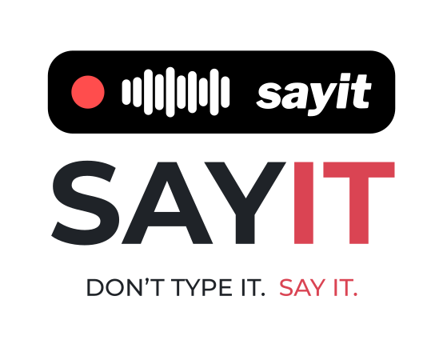
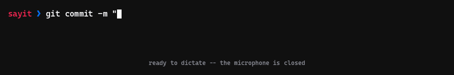

<p align="center">
  
</p>

# sayit

> Push-to-talk dictation for Linux and Windows 11. Hold a key, speak, release — your words are typed into whatever window has focus. Speech recognition runs on your machine: no cloud service, no account, no API keys.

[](https://github.com/MrTorriz/sayit/actions/workflows/ci.yml)
[](LICENSE)
[](#documentation)
[](#privacy)

<p align="center">
  
</p>

sayit runs [whisper.cpp](https://github.com/ggml-org/whisper.cpp) with Vulkan GPU acceleration and injects the transcribed text into the focused window — terminal, editor, browser, anything. It ships tuned for Swedish via [KB-Whisper](https://huggingface.co/KBLab/kb-whisper-medium), the National Library of Sweden's Whisper fine-tune, which beats OpenAI's `whisper-large-v3` on every Swedish benchmark at a fraction of the size ([KBLab's numbers](https://huggingface.co/KBLab/kb-whisper-medium): 47% lower WER on average for `kb-whisper-large`, around 38% for the default `medium`). It works with any GGML Whisper model and language.

Four stages are the whole product, and they are the same on both platforms:
capture 16 kHz mono WAV, transcribe it with whisper.cpp, apply your wordlist,
inject the result into the focused window. Only the first and the last are
platform code — how the microphone is opened, and how the finished text reaches
the window you are working in. [docs/ARCHITECTURE.md](docs/ARCHITECTURE.md) draws
the pipeline and both platforms' sequences.

## Documentation

| Document | What it answers |
| --- | --- |
| [docs/INSTALL-LINUX.md](docs/INSTALL-LINUX.md) | Requirements, install, triggers, ydotool, the meter, Bluetooth, the daemon |
| [docs/INSTALL-WINDOWS.md](docs/INSTALL-WINDOWS.md) | Requirements, install, the trigger, autostart, the indicator, injection |
| [docs/CONFIGURATION.md](docs/CONFIGURATION.md) | Every setting, its default, its platform, and when a change takes effect |
| [docs/TROUBLESHOOTING.md](docs/TROUBLESHOOTING.md) | Symptom, cause, and the command that fixes it |
| [docs/PERFORMANCE.md](docs/PERFORMANCE.md) | Measured latency, the machines, the dates, and what is not measured |
| [docs/ARCHITECTURE.md](docs/ARCHITECTURE.md) | Both pipelines, the components, and why each decision was made |
| [SECURITY.md](SECURITY.md) | The security model and how to report an issue privately |
| [CONTRIBUTING.md](CONTRIBUTING.md) | Which checks to run for which platform, and the style rules |

## Highlights

| | |
| --- | --- |
| **Local** | Speech recognition runs on your machine. No cloud service, no API key, no telemetry, no account — audio never leaves the machine |
| **Fast** | Vulkan GPU inference and a warm model daemon ([measured](docs/PERFORMANCE.md)) |
| **Works anywhere** | Layout-independent text injection — terminals, editors, browsers; Wayland and X11 on Linux |
| **Push-to-talk** | Hold-to-talk on a mouse thumb button and toggle on a hotkey, with a live voice meter and a recording indicator |
| **Learns your vocabulary** | Teach it your terms: `sayit-learn "get hub" "GitHub"` |
| **Measurable** | Built-in statistics and per-stage latency profiling on both platforms; a reproducible benchmark harness on Linux |
| **Bluetooth-aware** | On Linux, auto-switches headsets such as AirPods to their mic profile and back. Windows does that switch itself |

## Why sayit

- **Your audio stays here.** Unlike cloud dictation services there is no account, no audio upload, no word quota and no subscription — the model runs on your own GPU or CPU, and works offline. One optional Linux feature does send text off the machine, and it is off by default; see [Privacy](#privacy).
- **Native to the platform, not a port of one to the other.** The Linux side speaks PipeWire, systemd and Wayland — including KWin/Plasma, where most injection tricks fail. The Windows side is Windows PowerShell 5.1 plus small C# helpers and nothing else: no runtime to install, no package manager, no Python.
- **No wake word, no idle cost.** Push-to-talk with a real button: the microphone is only open while you hold it, and nothing runs between dictations except an idle warm model.
- **Small enough to audit.** A handful of scripts, one `.env`, a test suite per platform. No Electron, no framework.

## Two platforms, one repository

The two implementations share everything except code:

| Shared | Where |
| --- | --- |
| Model handling | The same pinned whisper.cpp release (`v1.9.2`), the same GGML model and Silero VAD files, and the same daemon-first contract: try the warm `whisper-server` on `127.0.0.1`, fall back to `whisper-cli` **only** on a transport failure |
| Wordlist format | `original<TAB>replacement`, sorted longest original first, applied sequentially, case-insensitive on word boundaries, literal strings — the same contract in `bin/sayit-wordlist` and `win\sayit-wordlist.ps1` |
| History format | `history.jsonl`, one JSON object per line with `time`, `seconds`, `words`, `text` — a history file is portable between the two |
| Settings | One `.env`, created from the shared `.env.example`, with the same names and meanings wherever a setting exists on both |
| Documentation and identity | These documents, and the mark |

The code is not shared, and there is nothing to share: bash, PipeWire and ydotool on
one side; PowerShell, `waveIn` and `SendInput` on the other.

| Stage | Linux (`bin/`) | Windows (`win\`) |
| --- | --- | --- |
| Capture | `pw-record` (PipeWire) | `waveIn` through `win\lib\Recorder.cs` |
| Stopping a recording | `SIGINT`, then poll until the recorder has exited | a named event; the recorder finalises its own RIFF header |
| Trigger | Solaar rules (mouse) or a desktop global shortcut | `WH_KEYBOARD_LL` / `WH_MOUSE_LL` in `win\sayit-trigger.ps1` |
| Injection | clipboard plus `Shift+Insert` (`ydotool`), with `wtype`/`xdotool` fallbacks | `SendInput` with `KEYEVENTF_UNICODE`; clipboard plus `Ctrl+V` above a length threshold |
| Indicator / meter | a persistent notification plus a separate meter that opens its own capture stream | one layered click-through window, fed by the level the recorder already computes |
| Warm model | a systemd user service | a scheduled task at logon starts a supervisor, which starts the daemon |
| Bluetooth | `bin/sayit-bt` switches A2DP to HFP and back | none: Windows selects HFP itself when an application opens a capture endpoint |
| Transient state | `$XDG_RUNTIME_DIR` (RAM-backed tmpfs) | `%LOCALAPPDATA%\sayit\run` (on disk, cleaned up explicitly) |

The reasoning behind each divergence is in
[docs/ARCHITECTURE.md](docs/ARCHITECTURE.md#where-they-diverge-and-why).

## Quickstart: Linux

```bash
git clone https://github.com/MrTorriz/sayit.git
cd sayit
./install.sh            # packages, pinned whisper.cpp build, checksummed models, .env
./bin/test-pipeline     # end-to-end check with a synthetic voice, no microphone needed
```

Then bind a trigger — a Logitech thumb button through Solaar, or any global hotkey —
and, on KWin/Plasma, set up `ydotoold` once. Text injection does not work there
without it.

Full walkthrough: [docs/INSTALL-LINUX.md](docs/INSTALL-LINUX.md).

## Quickstart: Windows 11

```powershell
git clone https://github.com/MrTorriz/sayit.git
cd sayit
.\win\install.ps1       # prerequisites, pinned build, model check, .env, logon task
.\win\sayit-doctor.ps1  # reports what resolved and what did not
```

Two steps the installer deliberately leaves to you: **download the two model files**
into `models\` yourself, and — if your mouse diverts its thumb button in firmware —
map that button in the vendor utility before the trigger can see it.

Full walkthrough: [docs/INSTALL-WINDOWS.md](docs/INSTALL-WINDOWS.md).

## Verifying an installation

```bash
./bin/test-pipeline           # Linux: synthetic voice through the whole pipeline
./bin/sayit doctor            # Linux: read-only check of the recording path
```

```powershell
.\win\sayit-doctor.ps1        # Windows: the same job for the Windows path
```

Each doctor resolves the microphone sayit will actually record from, reports the
daemon and any leftover state, and prints the command that fixes what it finds
rather than running it. The Linux one changes nothing at all; the Windows one
opens no capture stream and runs none of its own suggestions, but does create
its state directories on first run.

Neither dumps `.env`, your wordlist or any dictated text. Both do print
resolved local paths, device names and most setting values, so read the output
before pasting it anywhere public.

## Main commands

| What | Linux | Windows |
| --- | --- | --- |
| Toggle | `./bin/sayit` | `.\win\sayit.ps1` |
| Hold-mode start / stop | `./bin/sayit start` / `stop` | `.\win\sayit.ps1 start` / `stop` |
| Discard a recording | `./bin/sayit cancel` | `.\win\sayit.ps1 cancel` |
| Diagnose | `./bin/sayit doctor` | `.\win\sayit-doctor.ps1` |
| Transcribe a WAV | `./bin/sayit-transcribe rec.wav` | `.\win\sayit-transcribe.ps1 rec.wav` |
| History | `./bin/sayit-history` | `.\win\sayit-history.ps1` |
| Statistics | `./bin/sayit-history --stat` | `.\win\sayit-history.ps1 -Stat` |
| Teach a word | `./bin/sayit-learn "wrong" "right"` | `.\win\sayit-learn.ps1 "wrong" "right"` |
| Start the daemon | `systemctl --user start sayit-daemon` | `.\win\sayit-daemon.ps1 start` |
| Keep the pill on screen | `systemctl --user enable --now sayit-overlay` ([install the unit first](docs/INSTALL-LINUX.md#recording-indicator-and-live-meter)) | — |
| Move the indicator | drag the resident pill, or `./bin/sayit-overlay --place` | `.\win\sayit-indicator.ps1 place` |
| Smoke test | `./bin/test-pipeline` | — |

## Custom wordlist

Fix recurring mistranscriptions with a TSV of replacements. Same file format and
same matching rules on both platforms; only the path differs.

```text
get hub	GitHub
docker komposse	docker-compose
```

Faster than editing it by hand — teach sayit directly from a mistake:

```bash
./bin/sayit-learn "gitting nore" "gitignore"
```

The format, the matching rules and where the file lives are in
[docs/CONFIGURATION.md](docs/CONFIGURATION.md#custom-wordlist).

## Privacy

**Speech recognition and all audio processing run on your machine.** Audio never
leaves it: the only place a recording is ever sent is the warm `whisper-server`
on `127.0.0.1`, and the fallback path hands it to a local binary instead. There
is no telemetry and no account.

**One optional feature is the exception.** `LLM_CLEANUP=1`, Linux only and off by
default, POSTs the transcribed **text** to `LLM_URL` for a cleanup pass. `LLM_URL`
defaults to a local Ollama on `127.0.0.1`, which keeps the text on the machine. Point
it at another host and your dictated text goes to that host, in plain HTTP.

What exists on your machine either way:

- **Audio** lives in `$XDG_RUNTIME_DIR` on Linux, which is a RAM-backed tmpfs, and in
  `%LOCALAPPDATA%\sayit\run` on Windows, which is on disk because Windows has no tmpfs
  equivalent. It is deleted right after transcription; `sayit.ps1` also sweeps WAV
  files older than an hour when the next recording starts, and the doctor reports any
  that are left.
- **History**: every dictation's text is appended to
  `~/.local/share/sayit/history.jsonl` or `%LOCALAPPDATA%\sayit\history.jsonl` and
  kept until you clear it with `--clear` / `-Clear`. If a backup or sync tool sweeps
  that directory, your dictations follow it.
- **Clipboard**: on Linux the text always transits the clipboard during injection, so
  clipboard managers may archive it under their own retention rules. sayit restores
  your previous clipboard about a second after pasting — but only if you have not
  copied something new meanwhile — and clears the primary selection. Non-text
  clipboards and clipboards tagged by password managers are never read, saved or
  re-offered. On Windows the clipboard is used only above
  `INJECT_CLIPBOARD_THRESHOLD` or when typing is impossible; the text is marked to
  stay out of Win+V history and cloud sync, and the previous contents are **not**
  restored.
- **Notifications**: on Linux they show the first characters of a dictation and are
  sent as transient, so compliant servers do not retain them. The Windows side sends
  no notifications; its only feedback is the on-screen pill, which shows a level and
  never text.
- **Diagnostics**: failures append error classes — never text, never audio — to
  `sayit-last-error.log` in the run directory. On Linux that vanishes at logout; on
  Windows it does not.
- **The warm daemon** listens on `127.0.0.1` with no authentication, so any local
  process can reach it. Keep it on loopback.
- **Daemon logs are `whisper-server`'s own output** and can contain transcribed text.
  Never paste them into a public issue. The doctor output is the safer artefact,
  but it is not sanitised either — see the note under
  [Verifying an installation](#verifying-an-installation).
- **The two Windows diagnostic probes write what they observe to disk.**
  `sayit-trigger.ps1 -Probe` logs every key and button transition it sees, and
  `sayit-rawprobe.ps1` logs device IDs and raw HID bytes, both into
  `%LOCALAPPDATA%\sayit\run\` with no cleanup. Delete them when you are done.
  The trigger in its normal mode writes neither.

[SECURITY.md](SECURITY.md) has the full model and how to report an issue privately.

## Performance

With the warm daemon, a 2.2-second Swedish sentence transcribes in a median of
**1.62 s** on the Linux reference machine, about a second faster than the cold
`whisper-cli` fallback. On Windows, Vulkan is roughly **13.7x** faster than the CPU
build on encode.

Both figures come from one machine each, with the method, the dates and the
limitations stated: [docs/PERFORMANCE.md](docs/PERFORMANCE.md).

## Project structure

```text
sayit/
├── bin/            Linux implementation — bash, plus one Python file for the overlay
├── win/            Windows implementation — PowerShell 5.1, plus runtime-compiled C# in win/lib/
├── config/         desktop entry, systemd unit, example wordlist, example Solaar rules
├── docs/           the documents linked above, the mark, and demo.gif with the make-demo.py that generates it
├── icons/          theme icons: notification mark and OSD meter levels, light and dark
├── tests/          bats suite and the benchmark harness (Linux)
├── win/tests/      Pester suite (Windows)
├── models/         GGML model and Silero VAD — gitignored, fetched by the installer
├── install.sh      Linux setup
├── win/install.ps1 Windows setup
└── .env.example    configuration template, shared, with a Windows-only section
```

Each implementation has its own tests, and neither can break the other's CI job.

## Design notes

- **Why clipboard injection on Linux, and typing on Windows?** `ydotool type` sends
  US-layout keycodes, so any non-ASCII character breaks; clipboard plus `Shift+Insert`
  is exact for every language and toolkit. `SendInput` with `KEYEVENTF_UNICODE` sends
  the character itself, so Windows needs no such workaround — until the text is long
  enough to hit the OS cap, which is when it pastes instead.
- **Why per-session state?** Each recording gets its own WAV and an atomically claimed
  session file, so overlapping press and release events, double taps and back-to-back
  dictations can never kill the wrong process or read a half-written file.
- **Why a wordlist instead of fine-tuning?** Recurring mistranscriptions are highly
  personal — project names, brand names. A TSV file fixes most of them at zero
  training cost, and `sayit-learn` makes adding a rule a two-second operation.
- **Why push-to-talk instead of a wake word?** Deliberate scope: push-to-talk is more
  reliable, more private, and has no idle CPU cost.
- **Why one repository for two implementations?** The parts worth keeping identical —
  the model contract, the wordlist, the history format, the settings — are exactly the
  parts that are not code.

The full reasoning, both pipelines and the runtime state of each is in
[docs/ARCHITECTURE.md](docs/ARCHITECTURE.md).

## Contributing

Bug reports, fixes and focused features are welcome. [CONTRIBUTING.md](CONTRIBUTING.md)
has the setup, the style rules, and the exact checks to run for a Linux change and for
a Windows change — they are different lists, and neither side needs the other's.

CI runs three jobs. Two Linux jobs cover syntax, `shellcheck` and the
[Bats](https://github.com/bats-core/bats-core) suite; a Windows job parses every
`win\*.ps1`, compiles the C# helpers with `Add-Type`, runs PSScriptAnalyzer and
executes the Pester suite.

The workflow triggers only on pushes to `main` and on pull requests, so a feature
branch gets no run of its own — open the pull request to get one.

## License

MIT — see [LICENSE](LICENSE).
