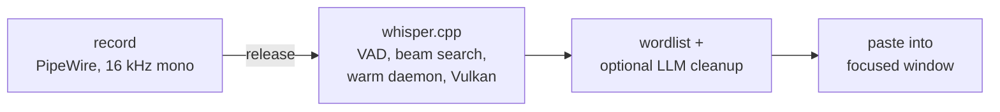

<p align="center">
  
</p>

# sayit

> Push-to-talk dictation for Linux. Hold a key, speak, release — your words are typed into whatever window has focus. 100% local, no cloud, no API keys.

[](https://github.com/MrTorriz/sayit/actions/workflows/ci.yml)
[](LICENSE)
[](#requirements)
[](#privacy-and-data-at-rest)

<p align="center">
  
</p>

sayit runs [whisper.cpp](https://github.com/ggml-org/whisper.cpp) with Vulkan GPU acceleration and injects the transcribed text into the focused window — terminal, editor, browser, anything. It ships tuned for Swedish via [KB-Whisper](https://huggingface.co/KBLab/kb-whisper-medium), the National Library of Sweden's Whisper fine-tune, which beats OpenAI's `whisper-large-v3` on every Swedish benchmark at a fraction of the size ([KBLab's numbers](https://huggingface.co/KBLab/kb-whisper-medium): 47% lower WER on average for `kb-whisper-large`, ~38% for the default `medium`). It works with any GGML Whisper model and language.



## Highlights

|                     |                                                                                    |
| ------------------- | ---------------------------------------------------------------------------------- |
| **Local**           | No cloud service, no API key, no telemetry — audio never leaves your machine       |
| **Fast**            | Vulkan GPU inference + a warm model daemon: a short sentence transcribes in ~1.6 s ([measured](#performance)) |
| **Works anywhere**  | Layout-independent text injection — terminals, editors, browsers, Wayland and X11  |
| **Push-to-talk**    | Toggle (hotkey) and hold-to-talk (mouse button via Solaar) modes, with a live voice meter and recording indicator |
| **Learns your vocabulary** | Teach it your terms: `sayit-learn "get hub" "GitHub"`                        |
| **Measurable**      | Built-in stats, latency profiling and a reproducible benchmark harness             |
| **Bluetooth-aware** | Auto-switches headsets (e.g. AirPods) to their mic profile and back                |

## Why sayit

- **Nothing leaves your machine.** Unlike cloud dictation services there is no account, no audio upload, no word quota and no subscription — the model runs on your own GPU or CPU, and works offline.
- **Built for Linux.** The polished dictation apps are macOS/Windows-only. sayit is native to PipeWire, systemd and Wayland — including KWin/Plasma, where most injection tricks fail.
- **No wake word, no idle cost.** Push-to-talk with a real button: the microphone is only open while you hold it, and nothing runs between dictations except an idle warm model.
- **Small enough to audit.** A handful of bash scripts, one `.env`, a test suite. No Electron, no runtime, no framework.

## Requirements

- Any Linux distribution with PipeWire (tested on Fedora KDE/Wayland; `install.sh` knows the package names for Fedora, Debian/Ubuntu and Arch)
- A Vulkan-capable GPU (recommended) or CPU fallback
- Python 3 and Perl (present on virtually every distro)

`install.sh` checks and offers to install everything else: `cmake`, a C++ toolchain, `git`, `curl`, PipeWire tools, `ydotool`, `wl-clipboard`, `jq`, `libnotify`, and the Vulkan development packages. Optional: `wtype` (injection fallback on wlroots compositors) and `espeak-ng` (used by the smoke test and the benchmark). On KWin/Wayland the `ydotoold` service needs a one-time setup — see [Text injection on KWin/Wayland](#text-injection-on-kwinwayland-ydotool).

## Installation

```bash
git clone https://github.com/MrTorriz/sayit.git
cd sayit
./install.sh                 # interactive
./install.sh -y              # answer yes to everything
./install.sh --model large   # best accuracy (default: medium)
./install.sh --help          # all flags
```

What `install.sh` does:

1. Verifies system packages (dnf/apt/pacman; prints a manual list elsewhere)
2. Clones and builds whisper.cpp at a **pinned release** in `~/.local/src/whisper.cpp` (Vulkan when available, CPU-only otherwise)
3. Symlinks `whisper-cli` → `~/.local/bin/whisper-cli`
4. Downloads the KB-Whisper model (q5_0) → `models/` and **verifies its sha256** against the published upstream checksum
5. Downloads the Silero VAD model (~1 MB), also checksum-verified
6. Creates `.env` from `.env.example` and seeds `~/.config/sayit/wordlist.tsv`

| Flag              | Effect                                          |
| ----------------- | ----------------------------------------------- |
| `-y`, `--yes`     | Answer yes to all prompts                       |
| `--model SIZE`    | Model size: `small` \| `medium` \| `large`      |
| `--rebuild`       | Re-fetch and rebuild whisper.cpp at the pinned release |
| `--skip-packages` | Skip the system package check                   |
| `--skip-build`    | Skip the whisper.cpp build                      |
| `--skip-model`    | Skip the model downloads                        |
| `-h`, `--help`    | Show help and exit                              |

### Upgrading and rollback

Re-running `./install.sh` is always safe: it never overwrites an existing `.env` (it reports settings your `.env` is missing), never re-downloads present models, and skips the build. To upgrade whisper.cpp to the release pinned in the script:

```bash
./install.sh --rebuild
```

To roll back or pin a different revision: `WHISPER_REF=<tag-or-commit> ./install.sh --rebuild`. The built revision is recorded in `~/.local/src/whisper.cpp/.sayit-build-info`.

## Usage

### Mouse button via Solaar (hold-to-talk, recommended)

Turn a Logitech mouse thumb button into push-to-talk via [Solaar](https://github.com/pwr-Solaar/Solaar): hold the button = record, release = transcribe + paste. Example in [`config/solaar-rules.example.yaml`](config/solaar-rules.example.yaml).

1. Divert the button (Solaar GUI: device → button → "Diverted", or set the control ID to `1` under `divert-keys` in `~/.config/solaar/config.yaml`). On the MX Master 3S, the large thumb plate ("Mouse Gesture Button") is control ID `195`.
2. Copy the example to `~/.config/solaar/rules.yaml` (fix the paths), restart Solaar.
3. The rules run `sayit start` on press and `sayit stop` on release.

> [!TIP]
> On Bluetooth microphones (e.g. AirPods), the profile switch typically takes around a second (up to ~2.5 s) before the mic is live. Wait for the recording indicator (or the "Recording" notification) before you start speaking — recording starts only once the microphone is actually capturing.

### Global hotkey (toggle)

Bind `bin/sayit` to any free key. On KDE: System Settings → Shortcuts → Custom Shortcuts (see [`config/kglobalshortcuts.example`](config/kglobalshortcuts.example) and the [`config/sayit.desktop`](config/sayit.desktop) template). Other desktops: any mechanism that runs a command on a keypress works.

1. Press the key → recording starts (indicator + notification shown)
2. Speak
3. Press again → stops, transcribes, pastes into the focused window

### Recording indicator and live meter

While the microphone is live, sayit shows two pieces of feedback:

- **A live voice meter** — the sayit mark itself is the meter: its bars follow your voice level and the dot burns red while the microphone is open, so you can see that dictation hears you. By default it is drawn as a small pill of sayit's own above your other windows (`RECORDING_METER_STYLE="overlay"`); clicks pass straight through it, so it can never be in the way. Put it wherever you like:

  ```bash
  ./bin/sayit-overlay --place    # drag the pill, Enter or Escape saves
  ```

  The position is remembered in `~/.config/sayit/overlay-position`.

- **A persistent notification** as the recording indicator; it appears when capture actually starts (after any Bluetooth profile switch) and is removed on stop, cancel and failure.

The two are independent: `RECORDING_METER=0` turns off the meter, `RECORDING_INDICATOR=0` the notification.

The meter opens its own low-rate PipeWire stream (the recording is unaffected) and uses the audio only to compute a level — nothing is stored. It has three styles, each falling back to the next when its requirements are missing, so it degrades instead of disappearing:

| `RECORDING_METER_STYLE` | What you get | Needs |
|---|---|---|
| `overlay` (default) | sayit's own pill, freely positionable, click-through | Wayland with layer-shell, plus the GTK bindings `install.sh` lists as optional |
| `mark` | the animated mark in Plasma's on-screen display | Plasma OSD + the theme icons `install.sh` installs |
| `wave` | a scrolling bar waveform in the same OSD | Plasma OSD |

The notification and the OSD styles use the sayit theme icons (light/dark variants following the desktop color scheme) and fall back to a generic microphone icon without them.

### Manual

```bash
./bin/sayit-transcribe recording.wav  # → text on stdout
./bin/sayit                           # toggle (same as the hotkey)
./bin/sayit start                     # hold-mode: start on key press
./bin/sayit stop                      # hold-mode: stop on key release
./bin/sayit cancel                    # discard the current recording
./bin/sayit doctor                    # read-only check of the recording path
./bin/test-pipeline                   # smoke test with a synthetic voice
```

### Text injection on KWin/Wayland (ydotool)

KWin (Plasma 6) does **not** expose the virtual-keyboard protocol, causing `wtype` to fail with `Compositor does not support the virtual keyboard protocol`. Use `ydotool` (uinput) instead.

<details>
<summary><b>KWin/Wayland setup instructions</b></summary>

The `ydotoold` daemon must be running with its socket accessible to your user. Set up a systemd override:

```bash
sudo mkdir -p /etc/systemd/system/ydotool.service.d
sudo tee /etc/systemd/system/ydotool.service.d/override.conf >/dev/null <<EOF
[Service]
ExecStart=
ExecStart=/usr/bin/ydotoold --socket-path=/run/.ydotool_socket --socket-perm=0660 --socket-own=$(id -u):$(id -g)
EOF
sudo systemctl daemon-reload
sudo systemctl enable --now ydotool.service
```

> [!NOTE]
> `sayit-inject` reads `YDOTOOL_SOCKET` (defaulting to `/run/.ydotool_socket`) and falls back automatically to `wtype` (wlroots) or `xdotool` (X11) depending on your session. Be aware that a user-accessible uinput socket lets **any** process running as your user synthesize input system-wide — an inherent trade-off of this approach on KWin.

</details>

> [!IMPORTANT]
> **Why clipboard pasting?** Synthetic typing tools (`ydotool type`) send US-layout keycodes, which drops or mangles non-ASCII characters (`å/ä/ö`) on other layouts. sayit instead copies the text to the clipboard and sends a single `Shift+Insert` — exact for every language and toolkit. Your previous clipboard is restored afterwards (see [Privacy and data at rest](#privacy-and-data-at-rest) for the exact rules).

### History and statistics

```bash
./bin/sayit-history              # latest 20 transcriptions
./bin/sayit-history 50           # latest 50
./bin/sayit-history --stat       # words, speaking WPM, time saved vs typing
./bin/sayit-history --stat 7d    # same, limited to a period (Nd/Nh/Nm)
./bin/sayit-history --copy 175   # copy entry 175 to the clipboard
./bin/sayit-history --inject 175 # re-inject entry 175 into the focused window
./bin/sayit-history --clear      # empty the history
```

<p align="center">
  
</p>

History lives in `~/.local/share/sayit/history.jsonl` (one JSON line per entry). The listing shows each entry's **absolute line number**, so the same N works directly with `--copy` and `--inject`. Corrupt lines (e.g. after a crash mid-write) are skipped with a warning — they never take the rest of the history down.

`--stat` estimates **time saved** by comparing your speaking time against how long the same number of words would take to type at `TYPING_WPM` words/min (default 40, adjustable in `.env`):

<p align="center">
  
</p>

### Bluetooth headsets

Bluetooth headphones (AirPods and friends) normally sit in the A2DP profile for high-quality playback — which exposes **no microphone**. `sayit` therefore switches the connected headset to its headset profile (HSP/HFP) when recording starts, records from its mic, and switches back on stop. Handled by `bin/sayit-bt`, no manual steps needed.

```bash
./bin/sayit-bt up     # -> headset profile, prints the source name
./bin/sayit-bt down   # -> restore the previous profile
```

- The headset is picked dynamically from the default output, so multiple headsets work without configuration.
- The headset profile degrades **playback** to phone quality (mSBC, 16 kHz mono) while recording — restored immediately on stop.
- With no Bluetooth headset connected, `sayit-bt` is a no-op and recording uses `AUDIO_SOURCE`/the PipeWire default mic.
- The profile switch is synchronous and typically takes around a second (up to ~2.5 s) — recording (and the indicator) starts once the mic is actually live, so wait for the indicator before speaking.
- **With a dedicated microphone, set `AUDIO_SOURCE`.** sayit then records straight from it and never touches the headset, so playback stays in A2DP throughout — no switch, no delay, no quality drop. `./bin/sayit doctor` confirms which of the two paths your configuration selects.

### Custom wordlist

Fix recurring mistranscriptions by adding terms to `~/.config/sayit/wordlist.tsv`:

```text
get hub	GitHub
docker komposse	docker-compose
```

Format: `original<TAB>replacement`. Applied case-insensitively on word boundaries after transcription, with longer originals tried first — so multi-word rules win over substrings regardless of line order. Rules are applied sequentially, so a replacement can itself be matched by a later, shorter rule. Lines starting with `#` are comments.

Faster: teach sayit directly from mistakes with `sayit-learn` (grows the wordlist, deduped):

```bash
./bin/sayit-learn "gitting nore" "gitignore"   # add
./bin/sayit-learn --list                       # show all
./bin/sayit-learn --undo "gitting nore"        # remove
```

## Configuration

Everything lives in `.env` (created by `install.sh` from [`.env.example`](.env.example)):

| Variable          | Default                          | Purpose                                             |
| ----------------- | -------------------------------- | --------------------------------------------------- |
| `MODEL_PATH`      | `models/ggml-kb-whisper-medium…` | GGML model file (empty = repo default)              |
| `SPEECH_LANGUAGE` | `sv`                             | ISO 639-1 language code passed to whisper           |
| `AUDIO_SOURCE`    | (empty)                          | Recording device (PipeWire node name); empty = headset mic / PipeWire default |
| `THREADS`         | `8`                              | CPU threads for the CLI fallback                    |
| `BEAM`            | `5`                              | Beam search size (`-1` = greedy)                    |
| `VAD_MODEL`       | `models/ggml-silero-v5.1.2.bin`  | Silero VAD; point at a missing file to disable      |
| `INITIAL_PROMPT`  | (empty)                          | Primes the decoder for your domain terms            |
| `SUPPRESS_REGEX`  | (empty)                          | Regex for stubborn hallucinated phrases             |
| `DAEMON_PORT`     | `9876`                           | Port for the warm whisper-server                    |
| `LLM_CLEANUP`     | `0`                              | `1` = LLM post-cleanup pass (needs GPU); **sends the transcribed text to `LLM_URL`** |
| `LLM_URL`         | `http://127.0.0.1:11434/api/generate` | Endpoint for that pass. Loopback = nothing leaves the machine; anything else does |
| `LLM_MODEL`       | (see `.env.example`)             | Model name passed to that endpoint                  |
| `TYPING_WPM`      | `40`                             | Assumed typing speed for the time-saved statistic   |
| `WORDLIST`        | `~/.config/sayit/wordlist.tsv`   | Replacement wordlist (grown by `sayit-learn`)       |
| `RECORDING_INDICATOR` | `1`                          | Persistent recording indicator; `0` = off           |
| `RECORDING_METER` | `1`                              | Live microphone meter in the Plasma OSD; `0` = off  |
| `RECORDING_METER_STYLE` | `overlay`                  | `overlay` = sayit's own pill; `mark` = animated mark in the Plasma OSD; `wave` = waveform in the OSD |

`WHISPER_CLI` and `WHISPER_SERVER` are binary paths written by `install.sh`; they are in `.env` but rarely need changing. `SPEECH_LANGUAGE` and `INITIAL_PROMPT` apply per dictation. `THREADS`, `BEAM` and `VAD_MODEL` apply immediately to the CLI fallback but are fixed at server start for the daemon — run `systemctl --user restart sayit-daemon.service` after changing them. `SUPPRESS_REGEX` always applies to the CLI fallback; it is forwarded to the daemon only when the installed `whisper-server` build supports the flag.

### Accuracy: VAD, beam search, initial prompt, suppression

Several settings raise quality (all on by default):

- **VAD (`VAD_MODEL`)** — Silero Voice Activity Detection filters out non-speech before the model sees the audio. Whisper hallucinates (ghost text, repeated phrases) on silence; VAD removes that risk at the edges of every recording.
- **Beam search (`BEAM`)** — `5` decodes more accurately than greedy (`-1`).
- **Suppress non-speech (`-sns`)** — the daemon and CLI always suppress non-speech tokens (`[music]`, brackets, noise). An optional `SUPPRESS_REGEX` additionally removes specific recurring junk strings.
- **Initial prompt (`INITIAL_PROMPT`)** — primes the decoder so domain terms and names are spelled right up front. Complements the after-the-fact wordlist.
- **Flash attention (`-fa`)** — always on; speeds up inference on GPU.

Optional: **LLM cleanup (`LLM_CLEANUP=1`)** fixes spelling, split words and obvious errors with context. It POSTs the transcribed text to `LLM_URL`, which defaults to a local Ollama — the only configuration in which the text stays on your machine. Worth the latency only with a GPU-accelerated Ollama: on CPU it is too slow (~15 s) and a small model can make technical terms worse, so it is **off by default**.

### Choosing a model size

WER (lower = better) from [KBLab's benchmarks](https://huggingface.co/KBLab/kb-whisper-medium) for Swedish, compared with OpenAI whisper-large-v3:

| Size                          | File (q5_0) | RAM    | Speed   | WER (FLEURS / CommonVoice / NST) |
| ----------------------------- | ----------- | ------ | ------- | -------------------------------- |
| `kb-whisper-small`            | 175 MB      | low    | fastest | 7.3 / 6.4 / 6.6                  |
| `kb-whisper-medium` (default) | 539 MB      | medium | fast    | 6.6 / 5.4 / 5.8                  |
| `kb-whisper-large`            | 1.1 GB      | high   | slower  | **5.4 / 4.1 / 5.2**              |
| OpenAI whisper-large-v3       | —           | high   | slower  | 7.8 / 9.5 / 11.3                 |

`large` makes ~10–24% fewer errors than `medium` depending on the test set (mean ~18%). With Vulkan + the daemon (model kept warm), the extra latency is small for short dictations.

```bash
./install.sh --model large     # or small
# point MODEL_PATH in .env at the new file, then restart the daemon:
systemctl --user restart sayit-daemon.service
```

For languages other than Swedish: download any GGML Whisper model (e.g. from [ggml-org](https://huggingface.co/ggerganov/whisper.cpp)), set `MODEL_PATH` and `SPEECH_LANGUAGE`.

## Daemon mode (lower latency)

Keeps the model warm in RAM via `whisper-server` (local HTTP on 127.0.0.1:9876):

```bash
cp config/systemd/sayit-daemon.service ~/.config/systemd/user/
# edit the two paths in the service file to your clone location, then:
systemctl --user daemon-reload
systemctl --user enable --now sayit-daemon.service
```

The service runs `bin/sayit-daemon`, which sources `.env` and starts `whisper-server` with the right model, VAD, flash attention and beam settings. Change the model or VAD in `.env` and `systemctl --user restart sayit-daemon.service` — no service-file editing needed.

`bin/sayit-transcribe` uses the server automatically when it responds (POST to `http://127.0.0.1:9876/inference`) and falls back to `whisper-cli` on transport errors. With the warm daemon the per-dictation model load disappears — see the measured numbers below. Note that `whisper-cli` and the model file are only needed for the fallback path; a healthy daemon serves on its own.

## Performance

Measured with the bundled harness ([`tests/benchmark.sh`](tests/benchmark.sh)) on the reference machine — Intel Core Ultra 9 185H, Intel Arc iGPU via Vulkan, Fedora 44, `kb-whisper-medium` q5_0 + Silero VAD, 2026-08-20. Wall time around `sayit-transcribe` (transcription incl. normalization and wordlist), synthetic 16 kHz Swedish test audio, 25 repetitions per warm speech scenario (10 for silence and the cold fallback):

| Scenario (audio length)                    |  n | median |   p95 |   max |
| ------------------------------------------ | -: | -----: | ----: | ----: |
| Warm daemon — short sentence (2.2 s)       | 25 | 1.62 s | 1.64 s | 1.64 s |
| Warm daemon — medium (8.7 s)               | 25 | 3.12 s | 3.28 s | 3.41 s |
| Warm daemon — long (20.8 s)                | 25 | 6.41 s | 6.67 s | 6.74 s |
| Warm daemon — silence (2.0 s)              | 10 | 0.06 s | 0.09 s | 0.09 s |
| Cold `whisper-cli` fallback — short        | 10 | 2.65 s | 2.71 s | 2.71 s |
| Cold `whisper-cli` fallback — medium       | 10 | 4.27 s | 4.37 s | 4.37 s |
| Daemon model load (service start)          |  1 | 0.95 s |     — |     — |

The warm daemon saves roughly a second per dictation versus the cold fallback. A silent recording returns in ~0.06 s — an empty answer from the daemon is final and never triggers a redundant cold re-run. Profiling overhead with `SAYIT_PROFILE=1` is below 1%. A deliberately wedged server (SIGSTOP) is capped by the audio-scaled request deadline and completes via the CLI fallback in ~15 s instead of hanging.

End-to-end "release to text" adds recorder shutdown, Bluetooth profile restore and clipboard injection on top of the warm figures — typically a few hundred milliseconds (estimate). On Bluetooth headsets, the A2DP→HFP profile switch before recording starts adds roughly 0.5–2.5 s of preparation at **press** time (estimate, not yet measured) — the recording indicator shows when the mic is actually live.

Reproduce it yourself:

```bash
BENCH_MODEL=models/ggml-kb-whisper-medium-q5_0.bin ./tests/benchmark.sh
```

Per-stage latency profiling of real dictations is built in: set `SAYIT_PROFILE=1` and read `$XDG_RUNTIME_DIR/sayit-profile.csv` (timestamps and stage names only — never dictated text).

## Privacy and data at rest

Speech recognition always runs locally, and audio never leaves the machine. There is no telemetry and no account. One optional feature is the exception: `LLM_CLEANUP=1` POSTs the transcribed text to `LLM_URL` — off by default, and pointed at a local Ollama (`127.0.0.1`) when you do turn it on. Point `LLM_URL` at another host and your dictated text goes there in plain HTTP.

What *does* exist on your machine:

- **Audio** lives only in `$XDG_RUNTIME_DIR` (RAM-backed tmpfs) during a dictation and is deleted right after transcription.
- **History**: every dictation's text is appended to `~/.local/share/sayit/history.jsonl` and kept until you run `sayit-history --clear`. If a backup tool sweeps `~/.local/share`, your dictations follow it — exclude the directory if that matters to you.
- **Clipboard**: the text transits the clipboard during injection, so clipboard managers (Klipper, CopyQ, …) may archive it under their own retention rules. sayit restores your previous clipboard ~1 s after pasting — but only if you haven't copied something new meanwhile — and clears the primary selection. Non-text clipboards (images) and clipboards tagged by password managers are never read, saved or re-offered.
- **Notifications** show the first characters of a dictation and are sent as transient (not retained in the notification history on compliant servers).
- **Diagnostics**: failures append error classes (never text or audio) to `$XDG_RUNTIME_DIR/sayit-last-error.log`, which vanishes at logout.
- The warm `whisper-server` listens on `127.0.0.1` only, with no authentication — any local process can reach it. Keep it on loopback.

See [SECURITY.md](SECURITY.md) for the security model and how to report issues.

## Troubleshooting

| Problem                                       | Fix                                                                                     |
| --------------------------------------------- | --------------------------------------------------------------------------------------- |
| `pw-record: command not found`                | Install your distro's PipeWire tools (`pipewire-utils` / `pipewire-bin` / `pipewire`)   |
| Vulkan errors during the build                | Install the Vulkan headers, loader and `glslc`, or accept the CPU-only build            |
| "Transcription failed: …" notification        | The error class is in the notification; details in `$XDG_RUNTIME_DIR/sayit-last-error.log` |
| Empty result                                  | Verify the mic: `pw-record --rate 16000 -c 1 -F s16 test.wav` (Ctrl+C, `paplay test.wav`) |
| High latency                                  | Switch to the `small` model or enable the daemon                                        |
| Text does not appear                          | On KWin `wtype` fails (no virtual-keyboard protocol) — set up `ydotool.service`, see above |
| `Compositor does not support the virtual keyboard protocol` | You are on KWin/Wayland — use the ydotool injection path (see Usage) |
| "Injection failed" notification               | `systemctl status ydotool` + `ls -l /run/.ydotool_socket` (must be owned by your user); the text is recoverable with `sayit-history --inject` |
| `Model missing` from `sayit-transcribe`       | Run `./install.sh` (or `--skip-packages --skip-build` if only the model is missing)     |
| whisper.cpp broken after an OS upgrade        | `./install.sh --rebuild`                                                                |
| No notifications                              | Install `libnotify` (`notify-send`)                                                     |
| Recording indicator never disappears          | `./bin/sayit-indicator hide` removes it manually                                        |
| No meter at all while recording               | Check `RECORDING_METER` in `.env`; `./bin/sayit-overlay --check` reports whether the overlay style can run here |
| Meter falls back to the Plasma OSD instead of the pill | The overlay needs a Wayland session with layer-shell plus `python3-gobject`, GTK 3 and `gtk-layer-shell` — see the optional packages in `install.sh` |
| Meter shows a waveform or a generic icon instead of the mark | Install the theme icons: `./install.sh --skip-packages --skip-build --skip-model` |
| The pill sits in the wrong place              | `./bin/sayit-overlay --place`, drag it, then press Enter                                |
| Recording starts but never stops              | Check `$XDG_RUNTIME_DIR/sayit.session` — it must name a live `pw-record` process        |
| Anything wrong with the recording path        | `./bin/sayit doctor` — read-only; resolves the source sayit will actually record from, reports the Bluetooth profile and any leftover state |
| `AUDIO_SOURCE` stopped working after a reboot | You configured a numeric PipeWire id; use the node name from `pactl list sources short` — `./bin/sayit doctor` says so explicitly |
| The USB mic is plugged in but has no source   | Its card is in an output-only profile — `./bin/sayit doctor` prints the `pactl set-card-profile` line that fixes it, whether the source is named by `AUDIO_SOURCE` or reached as the PipeWire default |
| Bluetooth headset records from the wrong mic  | Verify the headset is connected; try `./bin/sayit-bt up` (should print `bluez_input.…`) |
| Headset stuck in phone-quality audio          | Run `./bin/sayit-bt down` to force A2DP back after an abnormally aborted recording      |
| Solaar button does not trigger dictation      | Run `systemctl --user status solaar.service` and verify Solaar is running in your graphical session. |

Run `./bin/test-pipeline` for an end-to-end check with a synthetic voice (no microphone needed).

## Project structure

```text
sayit/
├── install.sh                          # one-time setup (packages, pinned build, checksummed models, .env)
├── LICENSE                             # MIT
├── SECURITY.md                         # security model + private reporting
├── CONTRIBUTING.md                     # dev setup, style rules, PR checklist
├── .env.example                        # configuration template
├── .github/                            # CI (shellcheck + bash -n + bats), issue/PR templates
├── docs/
│   ├── ARCHITECTURE.md                 # pipeline, components, latency profile, design decisions
│   ├── logo.svg                        # project mark (theme-aware SVG)
│   ├── demo.gif                        # the hold-to-talk flow, shown at the top of this README
│   ├── history_list.png                # screenshot: sayit-history list view
│   └── history_stat.png                # screenshot: sayit-history statistics view
├── bin/
│   ├── sayit                           # session state machine: record + transcribe + inject
│   ├── sayit-bt                        # Bluetooth headset A2DP <-> headset-mic switching
│   ├── sayit-doctor                    # read-only diagnostics for the recording path
│   ├── sayit-record                    # pw-record → 16 kHz mono WAV
│   ├── sayit-transcribe                # daemon-first whisper + VAD + prompt + (LLM) + wordlist
│   ├── sayit-daemon                    # wrapper: whisper-server with .env flags
│   ├── sayit-inject                    # wl-copy + Shift+Insert / ydotool / wtype / xdotool
│   ├── sayit-indicator                 # persistent recording indicator (notification-based)
│   ├── sayit-meter                     # live voice meter: picks a style and owns the capture
│   ├── sayit-overlay                   # the overlay style: sayit's own click-through pill (Python)
│   ├── sayit-history                   # history & statistics (time saved)
│   ├── sayit-learn                     # self-growing wordlist (learn from mistakes)
│   ├── sayit-wordlist                  # wordlist replacement engine (perl)
│   └── test-pipeline                   # smoke test with espeak-ng
├── icons/                              # theme icons: notification mark + OSD meter levels (light/dark)
├── config/
│   ├── wordlist.example.tsv            # starter wordlist (copied to ~/.config/sayit/)
│   ├── sayit.desktop                   # KDE application entry template
│   ├── kglobalshortcuts.example        # example KDE global shortcut
│   ├── solaar-rules.example.yaml       # example mouse-button hold-to-talk
│   └── systemd/sayit-daemon.service    # daemon mode (whisper-server)
├── tests/                              # bats test suite + benchmark harness
└── models/                             # GGML models + Silero VAD (gitignored)
```

## Design notes

- **Why clipboard injection?** Typing tools send US-layout keycodes; any non-ASCII character breaks. Clipboard + Shift+Insert is exact for every language and works across toolkits. The previous clipboard is restored afterwards, guarded so it never overwrites something you copied in the meantime.
- **Why per-session state?** Each recording gets its own WAV and an atomically claimed session file, so overlapping press/release events, double taps and back-to-back dictations can never kill the wrong process or read a half-written file.
- **Why a wordlist + initial prompt instead of fine-tuning?** Recurring mistranscriptions are highly personal (project names, brand names). A TSV file and a decoder prompt fix most of them with zero training cost, and `sayit-learn` makes adding a rule a two-second operation.
- **Why push-to-talk instead of a wake word?** Deliberate scope: push-to-talk is more reliable, more private, and has no idle CPU cost.

A deeper walkthrough — pipeline, components, latency profile and the reasoning
behind each design decision — lives in [docs/ARCHITECTURE.md](docs/ARCHITECTURE.md).

## Contributing

Bug reports, fixes and focused features are welcome — see
[CONTRIBUTING.md](CONTRIBUTING.md) for the dev setup, style rules and the
pre-PR checklist. CI runs `bash -n`, `shellcheck` and the
[Bats](https://github.com/bats-core/bats-core) test suite on every push and PR.

## License

MIT — see [LICENSE](LICENSE).
