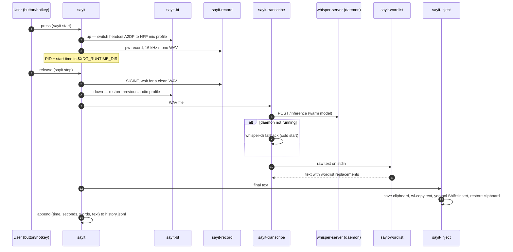

# Architecture

sayit is a pipeline of small, single-purpose bash scripts. Each stage can be
run and tested on its own; `bin/sayit` is the orchestrator that wires them
together and manages recording state.

## The pipeline

## Components

| Script | Single responsibility |
|---|---|
| `sayit` | State machine: toggle/hold/cancel, race guard, notifications, history |
| `sayit-bt` | Bluetooth headset profile switching (A2DP has no mic channel) |
| `sayit-record` | Audio capture only — PipeWire to 16 kHz mono WAV |
| `sayit-daemon` | Starts `whisper-server` from `.env` so the model stays warm in RAM |
| `sayit-transcribe` | Model I/O: daemon first, CLI fallback, token cleanup, optional LLM pass |
| `sayit-wordlist` | Pure text transform: stdin to stdout, TSV rules (unit-tested) |
| `sayit-inject` | Text delivery with a fallback chain per compositor |
| `sayit-history` | Read side of `history.jsonl`: listing, stats, re-inject |
| `sayit-learn` | Write side of the wordlist: add/undo/list with dedup |

## Runtime state

| Path | Purpose |
|---|---|
| `$XDG_RUNTIME_DIR/sayit.pid` | PID of the running recorder — presence means "recording" |
| `$XDG_RUNTIME_DIR/sayit.start` | Recording start timestamp (for duration stats) |
| `$XDG_RUNTIME_DIR/sayit.wav` | The recording in progress |
| `$XDG_RUNTIME_DIR/sayit.source` | Mic source name from the Bluetooth switch, passed to the recorder |
| `$XDG_DATA_HOME/sayit/history.jsonl` | One JSON object per dictation |
| `$XDG_CONFIG_HOME/sayit/wordlist.tsv` | User vocabulary, grown by `sayit-learn` |

## Performance & Latency Profiling

To achieve a seamless "hold-to-talk" experience, the pipeline is optimized to keep transcription latency below 1.5 seconds under normal operation. Here is a latency breakdown across the pipeline phases:

| Phase | Component | CPU Mode (Fallback) | GPU Mode (Vulkan + Warm Daemon) | Latency Mitigation Strategy |
|---|---|---|---|---|
| **Audio Capture** | `sayit-record` (pw-record) | 0.0 s | 0.0 s | Audio is written directly to a RAM-backed `/run/user/` tmpfs. |
| **Bluetooth Toggle** | `sayit-bt` | ~0.8 s - 1.2 s | ~0.8 s - 1.2 s | Switched asynchronously; active recording begins immediately when PipeWire opens. |
| **VAD Pre-Filtering** | `sayit-transcribe` (Silero) | ~0.4 s | ~0.1 s | Trims silence from the audio margins before feeding it to the model. |
| **Model Inference** | `whisper-cli` / `daemon` | ~1.5 s - 3.0 s | **~0.4 s - 0.7 s** | Warm daemon keeps the model in GPU RAM, bypassing the 0.8 s model load time. |
| **Vocabulary Matching**| `sayit-wordlist` (Perl) | < 0.01 s | < 0.01 s | Evaluated in a single-pass, compiled regex tree (longest original first). |
| **Text Delivery** | `sayit-inject` (ydotool) | < 0.1 s | < 0.1 s | Injected via clipboard `Shift+Insert` simulation to bypass slow key-by-key typing. |
| **Total Latency** | | **~2.2 s - 3.8 s** | **~1.3 s - 2.1 s** | Daemon mode reduces cold-start overhead by roughly 60%. |

## Design decisions

### Clipboard injection instead of synthetic typing

Typing tools (`ydotool type`) send US-layout keycodes: any non-ASCII character
— `å`, `ä`, `ö`, and even `?` on some layouts — is dropped or wrong. sayit
instead puts the text on the clipboard with `wl-copy` and sends a single
Shift+Insert. That is exact for every language and toolkit. The user's
previous clipboard is saved first and restored ~1 s after pasting (as bytes;
MIME types are not preserved). On compositors where native typing works,
`wtype` (wlroots) and `xdotool` (X11) remain as fallbacks — KWin/Plasma
notably does not expose the virtual-keyboard protocol, which is why the
clipboard path is the default.

### Warm daemon with cold-start fallback

whisper.cpp spends ~0.8 s per invocation just loading the model. The systemd
user service keeps a `whisper-server` running so transcription drops from
~2.2 s to ~1.3 s for a short sentence. `sayit-transcribe` probes the server
and silently falls back to `whisper-cli` when it is not running — the daemon
is an optimization, never a dependency.

### Bluetooth profile juggling

A2DP (the high-quality playback profile) has no microphone channel, so a
Bluetooth headset is silent as an input device until it is switched to its
headset profile (HSP/HFP, mSBC 16 kHz). `sayit-bt` does this switch on
record start and restores the previous profile on stop. Playback quality dips
for exactly the duration of the recording. The headset is discovered from the
default output at runtime, so nothing is hardcoded.

### VAD plus token suppression

Whisper hallucinates on silence — ghost sentences, repeated phrases, `[music]`
markers. Two layers remove that: Silero VAD filters non-speech audio before
the model sees it, and `-sns` (suppress non-speech tokens) removes bracketed
noise tokens at decode time. VAD costs ~0.4 s per dictation and is worth it.

### One-pass wordlist, longest rule first

All wordlist rules are applied in a single pass sorted by original length
descending, so a multi-word rule ("get hub" -> "GitHub") always beats a
substring rule ("hub" -> ...), regardless of file order. Matching is
case-insensitive on word boundaries and UTF-8 aware — `på` never matches
inside `påse`. Rules are literal strings, not regexes, so `sayit-learn`
input can never break the pipeline. See `tests/wordlist.bats` for the exact
contract.

### Race guard for hold-to-talk

A quick press-and-release can fire `sayit stop` while `start` is still
switching the Bluetooth profile and has not yet written the recorder's PID
file. `stop` polls for the PID file for up to ~3 s before giving up, so short
dictations are not lost.

### Deliberate non-goals

- **No cloud STT** — the value proposition is that audio never leaves the
  machine.
- **No wake word** — push-to-talk is more reliable, more private, and costs
  zero CPU when idle.
- **No GUI** — everything is scriptable and composable; notifications are the
  only UI.
