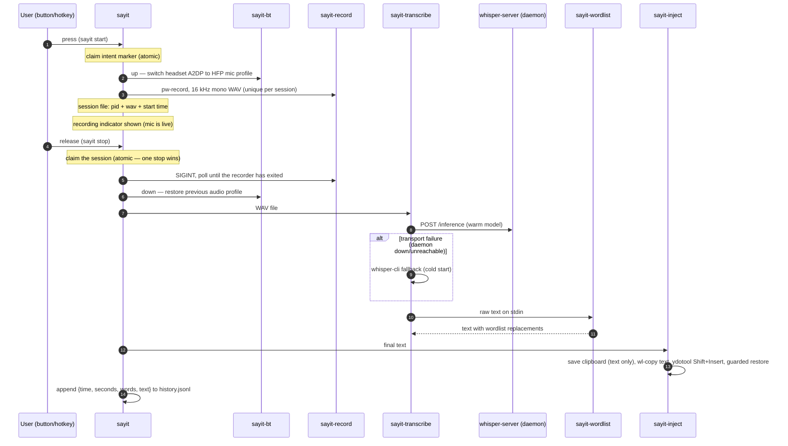

# Architecture

sayit is a pipeline of small, single-purpose bash scripts. Each stage can be
run and tested on its own; `bin/sayit` is the orchestrator that wires them
together and manages per-session recording state.

## The pipeline

## Components

| Script | Single responsibility |
|---|---|
| `sayit` | Session state machine: toggle/hold/cancel, atomic session claiming, PID identity checks, notifications, history |
| `sayit-bt` | Bluetooth headset profile switching (A2DP has no mic channel) |
| `sayit-doctor` | Read-only diagnostics: resolves `AUDIO_SOURCE` against live nodes, explains a missing source, reports the Bluetooth profile and leftover state |
| `sayit-record` | Audio capture only — PipeWire to 16 kHz mono WAV |
| `sayit-daemon` | Starts `whisper-server` from `.env` so the model stays warm in RAM |
| `sayit-transcribe` | Model I/O: daemon first, CLI fallback on transport errors, token cleanup, optional LLM pass |
| `sayit-wordlist` | Pure text transform: stdin to stdout, TSV rules (unit-tested) |
| `sayit-inject` | Text delivery with a fallback chain per compositor, clipboard hygiene |
| `sayit-indicator` | Persistent recording indicator (notification-based, safe fallbacks) |
| `sayit-meter` | Live voice meter: picks a style, owns the capture stream and its cleanup; feedback only |
| `sayit-overlay` | The overlay style — sayit's own click-through pill, drawn through layer-shell (the one Python script) |
| `sayit-history` | Read side of `history.jsonl`: listing, stats, re-inject; corrupt-line tolerant |
| `sayit-learn` | Write side of the wordlist: add/undo/list with dedup |

## Runtime state

All transient state lives in `$XDG_RUNTIME_DIR` (RAM-backed tmpfs, wiped at
logout); only history and the wordlist persist.

| Path | Purpose |
|---|---|
| `$XDG_RUNTIME_DIR/sayit.session` | One line: `pid<TAB>wav<TAB>start`. Presence means "recording". Claimed atomically (mv) by stop/cancel, so concurrent invocations cannot double-process a session |
| `$XDG_RUNTIME_DIR/sayit.starting` | Intent marker while `start` is still switching the Bluetooth profile; lets a quick release wait instead of giving up |
| `$XDG_RUNTIME_DIR/sayit-<pid>.wav` | The recording in progress — unique per session, so back-to-back dictations never overwrite each other |
| `$XDG_RUNTIME_DIR/sayit.bt` | Card name + previous audio profile, written by `sayit-bt up`, consumed by `down` (explains the "stuck in phone-quality audio" failure mode) |
| `$XDG_RUNTIME_DIR/sayit.indicator` | Notification ID of the visible recording indicator |
| `$XDG_RUNTIME_DIR/sayit.meter` | PID of the running meter — identity-checked against its command line before it is ever signalled |
| `$XDG_RUNTIME_DIR/sayit-last-error.log` | Error classes from failed stages (never dictated text) |
| `$XDG_RUNTIME_DIR/sayit-profile.csv` | Per-stage timestamps when `SAYIT_PROFILE=1` (timing data only) |
| `$XDG_DATA_HOME/sayit/history.jsonl` | One JSON object per dictation |
| `$XDG_CONFIG_HOME/sayit/wordlist.tsv` | User vocabulary, grown by `sayit-learn` |
| `$XDG_CONFIG_HOME/sayit/overlay-position` | Where the overlay pill sits, written by `sayit-overlay --place` |

PIDs read back from state files are trusted only after an identity check:
the process's command line must name the session's own (unique) WAV path,
so a recycled PID — even another recorder — is never signalled.

## Performance and latency

Measured with `tests/benchmark.sh` on the reference machine — Intel Core
Ultra 9 185H, Intel Arc iGPU (Vulkan), Fedora 44, `kb-whisper-medium` q5_0
with Silero VAD, 2026-08-20. The harness times `sayit-transcribe` end to end
(HTTP round trip or CLI, token cleanup, wordlist) against a dedicated
`whisper-server` instance, using synthetic 16 kHz Swedish speech:

| Scenario (audio length)                    |  n | median |   p95 |   max |
| ------------------------------------------ | -: | -----: | ----: | ----: |
| Warm daemon — short sentence (2.2 s)       | 25 | 1.62 s | 1.64 s | 1.64 s |
| Warm daemon — medium (8.7 s)               | 25 | 3.12 s | 3.28 s | 3.41 s |
| Warm daemon — long (20.8 s)                | 25 | 6.41 s | 6.67 s | 6.74 s |
| Warm daemon — silence (2.0 s)              | 10 | 0.06 s | 0.09 s | 0.09 s |
| Cold `whisper-cli` fallback — short        | 10 | 2.65 s | 2.71 s | 2.71 s |
| Cold `whisper-cli` fallback — medium       | 10 | 4.27 s | 4.37 s | 4.37 s |
| Daemon model load (service start)          |  1 | 0.95 s |     — |     — |
| Wedged server (SIGSTOP), incl. fallback    |  3 | 14.8 s |     — | 14.9 s |

Notes:

- **Warm vs cold**: the daemon removes the per-call model load entirely; the
  cold rows show the true cost of the `whisper-cli` fallback path.
- **Silence is cheap**: an empty transcription from a healthy daemon is
  accepted as authoritative — it never triggers a redundant cold re-run.
- **Deadline**: the daemon request times out after `audio seconds + 10 s`
  (with a 2 s connect timeout), so a wedged server cannot stall a short
  dictation for long; the request then falls back to the CLI.
- **Not covered by the harness**: microphone capture and the Bluetooth
  profile switch. On a BT headset, the A2DP→HFP switch happens synchronously
  at press time and takes roughly 0.5–2.5 s before capture starts (estimate,
  unmeasured) — the recording indicator appears when the mic is actually
  live. Clipboard injection adds on the order of 0.1 s after transcription.
- Per-stage timings of real dictations: run with `SAYIT_PROFILE=1` and read
  `$XDG_RUNTIME_DIR/sayit-profile.csv` (run id, wall clock, monotonic uptime,
  stage, numeric extra — never text).

## Design decisions

### Clipboard injection instead of synthetic typing

Typing tools (`ydotool type`) send US-layout keycodes: any non-ASCII character
— `å`, `ä`, `ö`, and even `?` on some layouts — is dropped or wrong. sayit
instead puts the text on the clipboard with `wl-copy` and sends a single
Shift+Insert. That is exact for every language and toolkit. Clipboard hygiene
rules: only a plain-text clipboard is saved and restored (~1 s after pasting,
and only if the clipboard still holds the dictation — a copy the user made in
the meantime is never overwritten); non-text clipboards and clipboards tagged
with a password-manager hint are never read or re-offered; the primary
selection is cleared after the paste window. On compositors where native
typing works, `wtype` (wlroots) and `xdotool` (X11 sessions only) remain as
fallbacks — KWin/Plasma notably does not expose the virtual-keyboard
protocol, which is why the clipboard path is the default.

### Per-session state with atomic claiming

Hold-to-talk generates racy event pairs: a release can arrive while start is
still switching the Bluetooth profile, buttons bounce, and users re-press
while the previous dictation is still transcribing. Every recording therefore
gets a unique WAV and a single session file written atomically; stop/cancel
*claim* the session with an atomic rename, so exactly one consumer wins.
An intent marker covers the pre-session window (a quick release waits for it
instead of giving up), stopping polls until the recorder has actually exited
(so the WAV header is finalized before it is read), and every signal is
preceded by a process-identity check. A start that cannot spawn its recorder
cleans up, restores the audio profile and reports — it never leaves state
behind.

### Warm daemon with cold-start fallback

whisper.cpp spends noticeable time per invocation just loading the model. The
systemd user service keeps a `whisper-server` running so that cost disappears
(see the measured table above). `sayit-transcribe` tries the server first and
falls back to `whisper-cli` **only on transport failures** — an empty answer
from a healthy daemon means "no speech" and is final. The daemon is optional;
but note the inverse dependency too: `whisper-cli` and the local model file
are only required when the fallback actually runs.

### Bluetooth profile juggling

A2DP (the high-quality playback profile) has no microphone channel, so a
Bluetooth headset is silent as an input device until it is switched to its
headset profile (HSP/HFP, mSBC 16 kHz). `sayit-bt` does this switch on record
start and restores the previous profile on stop. The switch is synchronous —
capture begins only after the mic is live, which is why the recording
indicator (rather than the button press) is the "start speaking" cue.
Playback quality dips for exactly the duration of the recording. The headset
is discovered from the default output at runtime, so nothing is hardcoded.

A configured `AUDIO_SOURCE` bypasses this path entirely: a dedicated
microphone is already an input device, so switching a headset that is only
playing audio would trade good playback for a microphone sayit was told not
to use. `sayit` therefore skips `sayit-bt` whenever `AUDIO_SOURCE` is set, and
the headset stays in A2DP for the whole recording.

The state file is written before the switch, not after, so a process killed
mid-switch still leaves `down` able to restore the profile. The mirror case is
handled explicitly: a switch that *fails* removes the record again, because a
profile the card was never taken out of must not be "restored" later.

### VAD plus token suppression

Whisper hallucinates on silence — ghost sentences, repeated phrases, `[music]`
markers. Two layers remove that: Silero VAD filters non-speech audio before
the model sees it, and `-sns` (suppress non-speech tokens) removes bracketed
noise tokens at decode time.

### Sequential wordlist, longest rule first

Wordlist rules are applied one substitution per rule, sorted by original
length descending, so a multi-word rule ("get hub" -> "GitHub") always beats a
substring rule ("hub" -> ...), regardless of file order. Matching is
case-insensitive on word boundaries and UTF-8 aware — `på` never matches
inside `påse`. Rules are literal strings, not regexes, so `sayit-learn`
input can never break the pipeline. Because rules run sequentially, a
replacement can itself be matched by a later, shorter rule — keep originals
specific. See `tests/wordlist.bats` for the exact contract.

### A recording indicator that can never break recording

The indicator is a persistent desktop notification (`notify-send --print-id`,
closed via the standard Notifications D-Bus interface). It appears only once
the microphone is actually capturing — not during the Bluetooth switch — and
is removed on stop, cancel and every failure path. Missing tools or an old
libnotify degrade it to a transient notification or a no-op; it never takes
focus, never blocks injection, and can be disabled with
`RECORDING_INDICATOR=0`.

The live meter takes the same idea further. While recording, `sayit-meter`
opens its own low-rate PipeWire capture (sources allow concurrent readers,
so the recording itself is untouched) and reduces the audio to a single
level about 8 times per second. The sayit mark IS the meter: its bars
follow the voice level and the dot burns red while the microphone is open.
The samples are used only for that computation; no audio is stored.

Three styles render it, each falling back to the next when its
requirements are missing, so the meter degrades instead of vanishing:

- **`overlay`** (default) — `sayit-overlay` draws sayit's own pill through
  the layer-shell protocol. It owns its appearance rather than borrowing a
  desktop's, it never takes focus, its input region is *empty* so clicks
  pass through to the window underneath, and it can be dragged anywhere
  (`--place`) with the position remembered. Needs Wayland with layer-shell
  and the GTK bindings; without them the meter drops to the OSD styles.
- **`mark`** — the same mark in Plasma's on-screen display, animated
  through pre-rendered theme icons (`sayit-level-0..7` plus an idle frame
  whose dot pulses). The icon tone is chosen once at start through the
  desktop portal's color-scheme setting, because hicolor-installed icons
  are not recolored by the theme. The full set is probed before this style
  is chosen: a half-installed set would otherwise blank out single frames.
- **`wave`** — a scrolling glyph waveform in the same OSD, the style that
  needs nothing but the OSD itself.

### Stopping a capture that ignores SIGPIPE

The meter runs `pw-cat | renderer`, and the obvious cleanup — kill the
renderer, let the writer die of SIGPIPE — is wrong here: `pw-cat` blocks
SIGPIPE (visible in its `SigIgn` mask), so it survives a vanished reader
and keeps the microphone open indefinitely as an orphan. In a dictation
tool that is a privacy defect, not an untidiness.

So the pipeline is spawned under job control (`set -m`), which puts it in
its own process group, and every exit path — signal, stop from
`sayit-indicator hide`, the renderer finishing on its own, the 120 s safety
cap — signals that whole group. One kill takes down the renderer and the
capture together, and the group never includes anything else.

### Read-only diagnostics as a separate command

The recording path fails in ways the recorder itself cannot explain: a node
name that no longer resolves looks identical whether the device is unplugged,
renamed, or merely sitting in a card profile that exposes no input. `pw-record`
reports only that the target is gone.

`sayit-doctor` answers the "why" without changing anything — it resolves
`AUDIO_SOURCE` against the sources PipeWire currently exposes, walks back to
the owning card when that fails, and prints the exact `pactl set-card-profile`
line that would restore an input. It is a separate command rather than a flag
on the recorder so that diagnosing a broken microphone never risks starting a
recording, and so every check stays trivially auditable as read-only: the only
audio commands it runs are `pactl info`, `pactl -f json list …` and
`pactl get-default-…`. It never issues a `set-` of any kind — the
`set-card-profile` lines it prints are text for the operator to run, not
commands it executes.

Every one of its queries is guarded. `pactl`'s JSON writer is not robust — it
emits the literal string `(null)` for a description it cannot encode — and a
card without a `profiles` key makes `jq` exit non-zero. Under `set -e` an
unguarded query would abort the run mid-report: a diagnostic tool dying on the
data it was asked to diagnose, exactly where the diagnosis was most needed.

### Deliberate non-goals

- **No cloud STT** — the value proposition is that audio never leaves the
  machine.
- **No wake word** — push-to-talk is more reliable, more private, and costs
  zero CPU when idle.
- **No GUI** — everything is scriptable and composable; notifications are the
  only UI.
