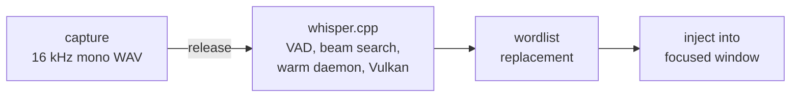
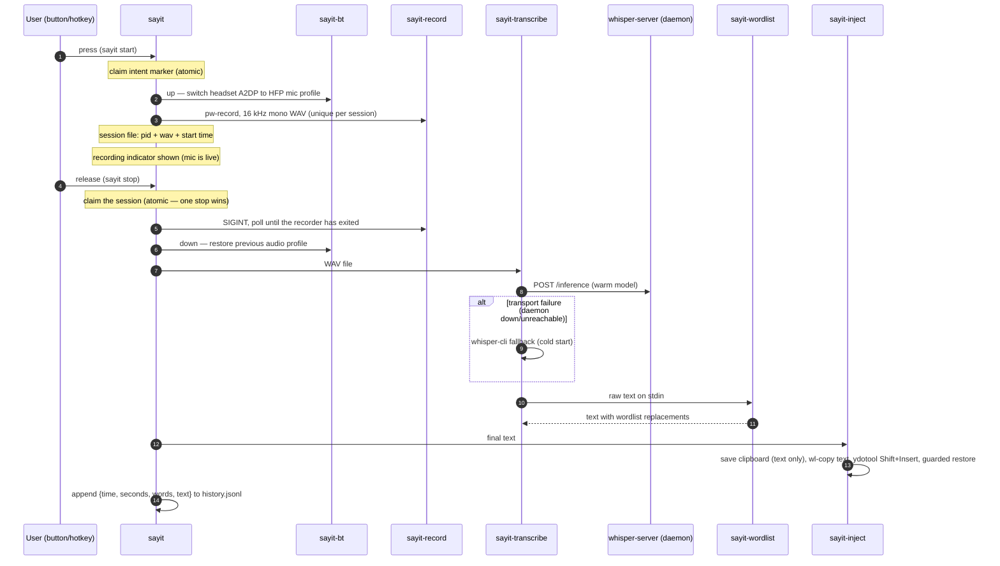

# Architecture

sayit is one pipeline with two implementations: a set of small bash scripts in
`bin/` for Linux, and a set of PowerShell scripts with runtime-compiled C#
helpers in `win\` for Windows 11. Each stage can be run and tested on its own;
`bin/sayit` and `win\sayit.ps1` are the orchestrators that wire the stages
together and manage per-session recording state.

The pipeline is identical on both platforms:



## One repository, two implementations

### What is shared

| Shared | Contract |
|---|---|
| **Model handling** | The same pinned whisper.cpp release (`v1.9.2`), the same GGML model and Silero VAD file, the same flags (`-fa`, `-sns`, beam, VAD), and the same daemon-first rule: POST to a local `whisper-server`, fall back to `whisper-cli` **only** on a transport failure |
| **Wordlist format** | `original<TAB>replacement`; rules sorted by original length descending, applied sequentially and globally, case-insensitive on Unicode word boundaries, originals treated as literal strings rather than regexes |
| **History format** | `history.jsonl`, one JSON object per line: `time` (local ISO-8601 to seconds), `seconds`, `words`, `text`. Same field names, order and types, so a history file is portable between the platforms |
| **Settings** | One `.env` from one `.env.example`. A setting that exists on both platforms has the same name and the same meaning; the file carries a clearly marked Windows-only section at the end |
| **Diagnostics discipline** | A separate read-only `doctor` command on each platform; error logs record error *classes*, never dictated text; profiling records timings, never text |
| **Documentation and identity** | This document, the README, the mark and its geometry — `win\sayit-indicator.ps1` and `bin/sayit-overlay` draw the same four baseline-aligned rounded bars and lamp, in the coordinate system of `docs/logo.svg`. The meter deliberately diverges from the logo: a fourth bar, and a larger dot on the mark's centre line rather than the logo's full stop on the baseline. `docs/logo.svg` and `icons/sayit-level-*.svg` keep the three-bar mark |

### Where they diverge, and why

None of the code is shared, because there is nothing to share: bash, PipeWire,
ydotool, systemd and layer-shell on one side; PowerShell 5.1, `waveIn`,
`SendInput`, Task Scheduler and WinForms on the other. Every divergence below is
forced by the platform, not chosen for taste.

| Stage | Linux | Windows | Why they cannot be the same |
|---|---|---|---|
| Capture | `pw-record` | `waveIn` via `lib\Recorder.cs` | There is no PipeWire on Windows. `waveIn` is a shim over the shared-mode audio engine, so 16 kHz mono 16-bit comes back resampled by the engine with no COM interop |
| Stopping the recorder | `SIGINT`, then poll until the process has exited so the WAV header is finalized | signal a named event; the recorder writes its own final RIFF header before exiting | Windows has no SIGINT equivalent for another process. An event is cleaner anyway: a truncated WAV stops being a failure mode |
| Trigger | Solaar rules (mouse) or a desktop global shortcut invoking `bin/sayit` | `WH_KEYBOARD_LL` and `WH_MOUSE_LL` in-process | Windows has no Solaar-equivalent rule engine. Of the Windows input APIs, only low-level hooks give both press and release for mouse side buttons *and* can suppress the event |
| Injection | clipboard + `Shift+Insert` via `ydotool`, with `wtype`/`xdotool` fallbacks | `SendInput` with `KEYEVENTF_UNICODE`, clipboard + `Ctrl+V` above a threshold | `ydotool` sends US scan codes, so non-ASCII breaks; `KEYEVENTF_UNICODE` sends the character itself and is layout independent by construction |
| Feedback | a persistent notification, plus a meter that opens its own capture stream | one layered click-through window, fed by the level the recorder already computed | Windows has no notification server to hold a persistent notification against, and no second capture stream is needed when the recorder can publish the level |
| Warm model | a systemd user service | `sayit-autostart.ps1`, started by a scheduled task at logon, or `sayit-daemon.ps1 start` by hand | No systemd |
| Keeping the trigger alive | systemd `Restart=` | `sayit-autostart.ps1` supervises it; the task's repeating trigger supervises the supervisor | The task scheduler's own `RestartOnFailure` was measured not to fire for this process, and a task cannot see inside its own instance |
| Bluetooth | `bin/sayit-bt` switches A2DP to HFP and restores it | nothing | Windows selects the HFP profile itself when an application opens a capture endpoint. The whole stage, its state file and the intent marker that covered the switch window are absent |
| Transient state | `$XDG_RUNTIME_DIR`, RAM-backed and wiped at logout | `%LOCALAPPDATA%\sayit\run`, on disk | Windows has no tmpfs equivalent, so cleanup is explicit: the WAV is deleted after transcription, stale WAVs older than an hour are swept at the next start, and `sayit-doctor.ps1` reports whatever is left |
| Config parsing | `.env` is sourced as bash | `.env` is parsed as `KEY=VALUE` data | Running arbitrary code from a config file is a worse trade on either platform, and nothing in `.env.example` needs it. The Windows reader expands `%VAR%` and nothing else |

## The Linux pipeline



### Components

| Script | Single responsibility |
|---|---|
| `sayit` | Session state machine: toggle/hold/cancel, atomic session claiming, PID identity checks, notifications, history |
| `sayit-bt` | Bluetooth headset profile switching (A2DP has no mic channel) |
| `sayit-doctor` | Read-only diagnostics: resolves `AUDIO_SOURCE` against live nodes, explains a missing source, reports the Bluetooth profile and leftover state |
| `sayit-record` | Audio capture only — PipeWire to 16 kHz mono WAV |
| `sayit-daemon` | Starts `whisper-server` from `.env` so the model stays warm in RAM |
| `sayit-transcribe` | Model I/O: daemon first, CLI fallback on transport errors, token cleanup, optional LLM pass |
| `sayit-wordlist` | Pure text transform: stdin to stdout, TSV rules (unit-tested) |
| `sayit-inject` | Text delivery with a fallback chain per compositor, clipboard hygiene |
| `sayit-indicator` | Persistent recording indicator (notification-based, safe fallbacks) |
| `sayit-meter` | Live voice meter: picks a style, owns the capture stream and its cleanup; feedback only |
| `sayit-overlay` | The overlay style — sayit's own click-through pill, drawn through layer-shell (the one Python script) |
| `sayit-history` | Read side of `history.jsonl`: listing, stats, re-inject; corrupt-line tolerant |
| `sayit-learn` | Write side of the wordlist: add/undo/list with dedup |

### Runtime state

All transient state lives in `$XDG_RUNTIME_DIR` (RAM-backed tmpfs, wiped at
logout); only history and the wordlist persist.

| Path | Purpose |
|---|---|
| `$XDG_RUNTIME_DIR/sayit.session` | One line: `pid<TAB>wav<TAB>start`. Presence means "recording". Claimed atomically (mv) by stop/cancel, so concurrent invocations cannot double-process a session |
| `$XDG_RUNTIME_DIR/sayit.starting` | Intent marker while `start` is still switching the Bluetooth profile; lets a quick release wait instead of giving up |
| `$XDG_RUNTIME_DIR/sayit-<pid>.wav` | The recording in progress — unique per session, so back-to-back dictations never overwrite each other |
| `$XDG_RUNTIME_DIR/sayit.bt` | Card name + previous audio profile, written by `sayit-bt up`, consumed by `down` (explains the "stuck in phone-quality audio" failure mode) |
| `$XDG_RUNTIME_DIR/sayit.indicator` | Notification ID of the visible recording indicator |
| `$XDG_RUNTIME_DIR/sayit.meter` | PID of the running meter — identity-checked against its command line before it is ever signalled |
| `$XDG_RUNTIME_DIR/sayit-last-error.log` | Error classes from failed stages (never dictated text) |
| `$XDG_RUNTIME_DIR/sayit-profile.csv` | Per-stage timestamps when `SAYIT_PROFILE=1` (timing data only) |
| `$XDG_DATA_HOME/sayit/history.jsonl` | One JSON object per dictation |
| `$XDG_CONFIG_HOME/sayit/wordlist.tsv` | User vocabulary, grown by `sayit-learn` |
| `$XDG_CONFIG_HOME/sayit/overlay-position` | Where the overlay pill sits, written by `sayit-overlay --place` |

PIDs read back from state files are trusted only after an identity check:
the process's command line must name the session's own (unique) WAV path,
so a recycled PID — even another recorder — is never signalled.

## The Windows pipeline

```mermaid
sequenceDiagram
    autonumber
    participant U as User (button/hotkey)
    participant TR as sayit-trigger.ps1
    participant S as sayit.ps1
    participant R as sayit-record.ps1
    participant IN as sayit-indicator.ps1
    participant T as sayit-transcribe.ps1
    participant D as whisper-server (daemon)

    U->>TR: press (WH_MOUSE_LL / WH_KEYBOARD_LL, event suppressed)
    TR->>S: sayit.ps1 start
    S->>R: spawn recorder (waveIn, 16 kHz mono WAV, named stop event)
    Note over S: session file: pid + wav + start + event name
    S->>IN: show
    R-->>IN: level 0..7 through the run directory
    U->>TR: release
    TR->>S: sayit.ps1 stop
    Note over S: claim the session (atomic rename — one stop wins)
    S->>IN: hide
    S->>R: set the stop event; the recorder writes its final RIFF header
    S->>T: WAV file
    T->>D: POST /inference (warm model)
    alt transport failure (daemon down/unreachable)
        T->>T: whisper-cli fallback (cold start)
    end
    Note over T: strip special tokens, collapse whitespace, then the wordlist
    T-->>S: final text on stdout
    Note over S: inject in-process — SendInput Unicode, or clipboard + Ctrl+V
    S->>S: append {time, seconds, words, text} to history.jsonl
```

### Components

| Script | Single responsibility |
|---|---|
| `sayit.ps1` | Session state machine: toggle/hold/cancel, atomic session claiming, history. Injects in-process |
| `sayit-trigger.ps1` | The push-to-talk hook: binds one button, optionally suppresses it, and runs `start`/`stop`. `-Probe` reports transitions without binding or suppressing anything |
| `sayit-rawprobe.ps1` | Diagnostic only: Raw Input observation for buttons that report as HID consumer-control usages rather than as mouse buttons |
| `sayit-record.ps1` | Audio capture only — `waveIn` to 16 kHz mono WAV, stopped by a named event, capped by `MAX_RECORD_SECONDS`. Also publishes the level and reports a digitally silent capture |
| `sayit-daemon.ps1` | Starts, stops and probes `whisper-server` from `.env` so the model stays warm |
| `sayit-transcribe.ps1` | Model I/O: daemon first, CLI fallback on transport errors, token cleanup, wordlist |
| `sayit-wordlist.ps1` | Command-line front end to the wordlist engine in `lib\common.ps1` |
| `sayit-inject.ps1` | Text delivery front end for manual use and for `sayit-history.ps1 -Inject` |
| `sayit-indicator.ps1` | The on-screen pill: `show`, `hide`, `place`. Feedback only |
| `sayit-doctor.ps1` | Read-only diagnostics: backend, models, daemon, capture devices, resolved settings, leftover state, platform limits |
| `sayit-history.ps1` | Read side of `history.jsonl`: listing, stats, copy, re-inject; corrupt-line tolerant |
| `sayit-learn.ps1` | Write side of the wordlist: add/undo/list with dedup |
| `sayit-autostart.ps1` | Supervisor: starts the daemon without waiting, holds the trigger up, restarts it when it exits or stops answering, and cancels a recording an abnormal exit left behind |
| `install.ps1` | Prerequisites, the pinned whisper.cpp build, the model check, `.env`, the wordlist seed and the optional logon task |

| Helper | Responsibility |
|---|---|
| `lib\common.ps1` | Paths, `.env` reader, UTF-8 file IO without a BOM, stage profiling, the wordlist engine, the C# source merger, the error log |
| `lib\inject.ps1` | The injection decision: elevated-target check, method by length, clipboard fallback |
| `lib\Recorder.cs` | `waveIn` capture, the RIFF writer, peak tracking and level publishing, device enumeration and resolution |
| `lib\Trigger.cs` | The low-level keyboard and mouse hooks, the event queue and the injection signature |
| `lib\Injector.cs` | `SendInput` Unicode typing, the clipboard with its history and cloud opt-outs, the paste chord, the integrity-level check |
| `lib\RawInput.cs` | Raw Input registration and decoding for the diagnostic probe |

The C# helpers are compiled at runtime by `Add-Type` using the in-box compiler,
so they are kept to C# 5 syntax — Windows PowerShell 5.1 supports no later
language version. `Injector.cs` references a constant from `Trigger.cs`, so the
two must be compiled together; `Merge-CSharpSources` hoists every `using`
directive to the top before concatenating, because the naive concatenation is
invalid C#. CI compiles all four files for exactly this reason: a syntax error
in them would otherwise only surface on a user's machine.

### Runtime state

Windows has no RAM-backed equivalent of `$XDG_RUNTIME_DIR`, so transient state
lives on disk under `%LOCALAPPDATA%\sayit\run` and is cleaned up explicitly.

| Path | Purpose |
|---|---|
| `%LOCALAPPDATA%\sayit\run\sayit.session` | One line: `pid<TAB>wav<TAB>start<TAB>stop-event-name`. Presence means "recording". Claimed by an atomic rename, so exactly one stop or cancel wins |
| `%LOCALAPPDATA%\sayit\run\sayit-<pid>.wav` | The recording in progress — unique per session. Deleted after transcription; stragglers older than an hour are swept when the next recording starts |
| `%LOCALAPPDATA%\sayit\run\level` | The current level, `0`–`7`, written by the recorder and read by the indicator |
| `%LOCALAPPDATA%\sayit\run\indicator.on` | Presence means the indicator should stay up; `sayit-indicator.ps1 hide` removes it and the indicator closes itself on its next tick |
| `%LOCALAPPDATA%\sayit\run\daemon.pid` | PID of `whisper-server`, identity-checked against the binary's file name before it is ever signalled |
| `%LOCALAPPDATA%\sayit\run\sayit-last-error.log` | Error classes from failed stages (never dictated text). Unlike its Linux counterpart it survives logout |
| `%LOCALAPPDATA%\sayit\run\sayit-profile.csv` | Per-stage timestamps when `SAYIT_PROFILE` is set (timing data only) |
| `%LOCALAPPDATA%\sayit\run\trigger-probe.log`, `rawprobe.log` | Transcripts of the two diagnostic probes: button transitions, never text |
| `%LOCALAPPDATA%\sayit\history.jsonl` | One JSON object per dictation |
| `%APPDATA%\sayit\wordlist.tsv` | User vocabulary, grown by `sayit-learn.ps1` |
| `%APPDATA%\sayit\overlay-position` | Where the pill sits, written by `sayit-indicator.ps1 place` |

The stop path does not depend on the recorded PID being the right process: it
signals the session's own named event, which no other session can be waiting on.
The PID is used to wait for the recorder to exit and, only as a last resort after
four seconds, to force it down. `sayit-doctor.ps1` identifies recorders by
command line instead, which is how it distinguishes an orphan from the live
session's own recorder.

## Performance and latency

### Linux reference machine

Measured with `tests/benchmark.sh` — Intel Core Ultra 9 185H, Intel Arc iGPU
(Vulkan), Fedora 44, `kb-whisper-medium` q5_0 with Silero VAD, 2026-08-20. The
harness times `sayit-transcribe` end to end (HTTP round trip or CLI, token
cleanup, wordlist) against a dedicated `whisper-server` instance, using synthetic
16 kHz Swedish speech:

| Scenario (audio length)                    |  n | median |   p95 |   max |
| ------------------------------------------ | -: | -----: | ----: | ----: |
| Warm daemon — short sentence (2.2 s)       | 25 | 1.62 s | 1.64 s | 1.64 s |
| Warm daemon — medium (8.7 s)               | 25 | 3.12 s | 3.28 s | 3.41 s |
| Warm daemon — long (20.8 s)                | 25 | 6.41 s | 6.67 s | 6.74 s |
| Warm daemon — silence (2.0 s)              | 10 | 0.06 s | 0.09 s | 0.09 s |
| Cold `whisper-cli` fallback — short        | 10 | 2.65 s | 2.71 s | 2.71 s |
| Cold `whisper-cli` fallback — medium       | 10 | 4.27 s | 4.37 s | 4.37 s |
| Daemon model load (service start)          |  1 | 0.95 s |     — |     — |
| Wedged server (SIGSTOP), incl. fallback    |  3 | 14.8 s |     — | 14.9 s |

Notes:

- **Warm vs cold**: the daemon removes the per-call model load entirely; the
  cold rows show the true cost of the `whisper-cli` fallback path.
- **Silence is cheap**: an empty transcription from a healthy daemon is
  accepted as authoritative — it never triggers a redundant cold re-run.
- **Deadline**: the daemon request times out after `audio seconds + 10 s`
  (with a 2 s connect timeout), so a wedged server cannot stall a short
  dictation for long; the request then falls back to the CLI.
- **Not covered by the harness**: microphone capture and the Bluetooth
  profile switch. On a BT headset, the A2DP→HFP switch happens synchronously
  at press time and takes roughly 0.5–2.5 s before capture starts (estimate,
  unmeasured) — the recording indicator appears when the mic is actually
  live. Clipboard injection adds on the order of 0.1 s after transcription.
- Per-stage timings of real dictations: run with `SAYIT_PROFILE=1` and read
  `$XDG_RUNTIME_DIR/sayit-profile.csv` (run id, wall clock, monotonic uptime,
  stage, numeric extra — never text).

### Windows reference machine

The bats harness is bash and does not run on Windows. These numbers come from
whisper.cpp's own `whisper-bench` and from sayit's per-stage profiling — Intel
Core Ultra 9 185H, Intel Arc integrated graphics, Windows 11 build 26200,
`kb-whisper-medium` q5_0 with Silero VAD, 2026-08-22.

Encode time, three repetitions interleaved with cooldowns:

| Backend | run 1 | run 2 | run 3 | median |
| --- | ---: | ---: | ---: | ---: |
| Vulkan on the Arc integrated GPU | 723.7 ms | 676.0 ms | 957.7 ms | **723.7 ms** |
| CPU with OpenBLAS, 6 threads | 8953.0 ms | 9888.4 ms | 10340.4 ms | **9888.4 ms** |

End to end, from releasing the button to the text appearing, three dictations
with `SAYIT_PROFILE=1`:

| Dictation | 1 | 2 | 3 | median |
| --- | ---: | ---: | ---: | ---: |
| Release to text | 2.37 s | 4.81 s | 2.47 s | **2.47 s** |

Notes:

- **Vulkan is about 13.7x faster than the CPU build on encode.** Decode per
  step: 16.1–21.0 ms on Vulkan against 29.8–33.9 ms on CPU. The CPU figures
  degrade monotonically across the three runs as the laptop heats up; the
  Vulkan figures stay flat.
- **Getting Vulkan at all requires building from source.** There is no official
  prebuilt Vulkan binary of whisper.cpp for Windows, and integrated-GPU support
  only arrived in whisper.cpp v1.8.3, so older third-party Vulkan builds
  silently run on the CPU. `win\install.ps1` pins v1.9.2, matching `install.sh`.
- **Stage breakdown across those three dictations**: the daemon round trip took
  1.18–2.90 s, wordlist replacement 0.02 s, injection 0.18 s and stopping the
  recorder about 0.2 s. Daemon model load at service start: 2.63 s.
- **Two costs were removed by not spawning PowerShell.** Starting a second
  PowerShell to deliver the text cost about a second per dictation, roughly a
  quarter of the release-to-text latency, so `sayit.ps1` dot-sources
  `lib\inject.ps1` and injects in-process. Spawning one to apply the wordlist
  cost about 0.8 s, a fifth of the total, so the wordlist engine lives in
  `lib\common.ps1` and `sayit-transcribe.ps1` calls it directly. The separate
  `sayit-inject.ps1` and `sayit-wordlist.ps1` front ends remain for manual use.

## Design decisions

### Shared

#### Warm daemon with cold-start fallback

whisper.cpp spends noticeable time per invocation just loading the model. A
`whisper-server` kept running removes that cost entirely (see the measured tables
above) — as a systemd user service on Linux, and on Windows as the first thing
`sayit-autostart.ps1` does, itself started by a scheduled task at logon. It is
started without waiting for it, so the push-to-talk trigger is armed while the
model is still loading rather than after it. Both transcribers try the server
first and fall back to `whisper-cli`
**only on transport failures**: an empty answer from a healthy daemon means "no
speech" and is final, and re-running it on the CLI would spend a second to get
the same answer. The daemon is optional; note the inverse dependency too, on both
platforms: `whisper-cli` and the local model file are only required when the
fallback actually runs.

#### VAD plus token suppression

Whisper hallucinates on silence — ghost sentences, repeated phrases, `[music]`
markers. Two layers remove that: Silero VAD filters non-speech audio before the
model sees it, and `-sns` (suppress non-speech tokens) removes bracketed noise
tokens at decode time.

Where VAD *cuts* is tuned identically on both platforms, and not at whisper.cpp's
own defaults. A segment ends at the first 32 ms frame whose speech probability
falls below `VAD_THRESHOLD` − 0.15, after which only `VAD_SPEECH_PAD_MS` is added
back; the default 30 ms therefore cuts inside the 80–150 ms a Swedish unvoiced
final (`-t`, `-s`, `-st`, `-rt`) occupies. `VAD_MIN_SILENCE_MS` does not help,
however high it is set — it delays when a segment is closed, not where it ends.
`VAD_MIN_SPEECH_MS` is a correctness setting rather than a quality one: whisper
discards shorter segments, and when every segment is discarded the transcription
still succeeds, empty and without an error, so a one-word answer can vanish
silently. sayit defaults it to `0`. All four travel with the request on both
platforms, so a change applies to the next dictation without a daemon restart.

#### Sequential wordlist, longest rule first

Wordlist rules are applied one substitution per rule, sorted by original
length descending, so a multi-word rule ("get hub" -> "GitHub") always beats a
substring rule ("hub" -> ...), regardless of file order. Matching is
case-insensitive on word boundaries and UTF-8 aware — `på` never matches
inside `påse`. Rules are literal strings, not regexes, so `sayit-learn`
input can never break the pipeline. Because rules run sequentially, a
replacement can itself be matched by a later, shorter rule — keep originals
specific. See `tests/wordlist.bats` and `win\tests\Wordlist.Tests.ps1` for the
exact contract; both suites assert the same behaviour.

#### Per-session state with atomic claiming

Hold-to-talk generates racy event pairs: buttons bounce, and users re-press while
the previous dictation is still transcribing. Every recording therefore gets a
unique WAV and a single session file written atomically; stop and cancel *claim*
the session with an atomic rename, so exactly one consumer wins. A start that
cannot spawn its recorder cleans up and reports — it never leaves state behind.

The two platforms differ in what follows the claim. On Linux a release can arrive
while start is still switching the Bluetooth profile, so an intent marker covers
that window and a quick release waits for it instead of giving up; stopping then
sends `SIGINT` and polls until the recorder has exited, so the WAV header is
finalized before it is read, and every signal is preceded by a process-identity
check. On Windows there is no profile switch to cover and therefore no intent
marker, and stopping sets a named event that the recorder itself waits on — the
recorder writes its own final RIFF header, so a half-written file is not a
failure mode there.

#### Read-only diagnostics as a separate command

The recording path fails in ways the recorder itself cannot explain. Both
platforms therefore ship a `doctor` that answers "why" without changing anything,
as a separate command rather than a flag on the recorder, so that diagnosing a
broken microphone never risks starting a recording and every check stays trivially
auditable as read-only.

On Linux, a node name that no longer resolves looks identical whether the device
is unplugged, renamed, or merely sitting in a card profile that exposes no input;
`pw-record` reports only that the target is gone. `sayit-doctor` resolves
`AUDIO_SOURCE` against the sources PipeWire currently exposes, walks back to the
owning card when that fails, and prints the exact `pactl set-card-profile` line
that would restore an input. The only audio commands it runs are `pactl info`,
`pactl -f json list …` and `pactl get-default-…`; it never issues a `set-` of any
kind — the lines it prints are text for the operator to run.

Every one of its queries is guarded. `pactl`'s JSON writer is not robust — it
emits the literal string `(null)` for a description it cannot encode — and a card
without a `profiles` key makes `jq` exit non-zero. Under `set -e` an unguarded
query would abort the run mid-report: a diagnostic tool dying on the data it was
asked to diagnose, exactly where the diagnosis was most needed.

On Windows, `sayit-doctor.ps1` enumerates capture devices with `waveInGetDevCaps`
only, which reports what the driver exposes without opening the device, and
resolves `AUDIO_SOURCE` exactly the way the recorder does. It also reports what
no other command can tell you at a glance: whether `ggml-vulkan.dll` sits beside
the binaries (the thing that decides whether the build can use the GPU), what
`.sayit-build-info` recorded, whether the daemon answers, stale sessions,
orphaned recorder processes and leftover WAV files. It prints resolved settings
but never `.env` itself, and for `INITIAL_PROMPT` and `SUPPRESS_REGEX` only
whether they are set — both hold text the user wrote.

### Linux

#### Clipboard injection instead of synthetic typing

Typing tools (`ydotool type`) send US-layout keycodes: any non-ASCII character
— `å`, `ä`, `ö`, and even `?` on some layouts — is dropped or wrong. sayit
instead puts the text on the clipboard with `wl-copy` and sends a single
Shift+Insert. That is exact for every language and toolkit. Clipboard hygiene
rules: only a plain-text clipboard is saved and restored (~1 s after pasting,
and only if the clipboard still holds the dictation — a copy the user made in
the meantime is never overwritten); non-text clipboards and clipboards tagged
with a password-manager hint are never read or re-offered; the primary
selection is cleared after the paste window. On compositors where native
typing works, `wtype` (wlroots) and `xdotool` (X11 sessions only) remain as
fallbacks — KWin/Plasma notably does not expose the virtual-keyboard
protocol, which is why the clipboard path is the default.

#### Bluetooth profile juggling

A2DP (the high-quality playback profile) has no microphone channel, so a
Bluetooth headset is silent as an input device until it is switched to its
headset profile (HSP/HFP, mSBC 16 kHz). `sayit-bt` does this switch on record
start and restores the previous profile on stop. The switch is synchronous —
capture begins only after the mic is live, which is why the recording
indicator (rather than the button press) is the "start speaking" cue.
Playback quality dips for exactly the duration of the recording. The headset
is discovered from the default output at runtime, so nothing is hardcoded.

A configured `AUDIO_SOURCE` bypasses this path entirely: a dedicated
microphone is already an input device, so switching a headset that is only
playing audio would trade good playback for a microphone sayit was told not
to use. `sayit` therefore skips `sayit-bt` whenever `AUDIO_SOURCE` is set, and
the headset stays in A2DP for the whole recording.

The state file is written before the switch, not after, so a process killed
mid-switch still leaves `down` able to restore the profile. The mirror case is
handled explicitly: a switch that *fails* removes the record again, because a
profile the card was never taken out of must not be "restored" later.

None of this exists on Windows, which selects HFP itself when an application
opens a capture endpoint.

#### A recording indicator that can never break recording

The indicator is a persistent desktop notification (`notify-send --print-id`,
closed via the standard Notifications D-Bus interface). It appears only once
the microphone is actually capturing — not during the Bluetooth switch — and
is removed on stop, cancel and every failure path. Missing tools or an old
libnotify degrade it to a transient notification or a no-op; it never takes
focus, never blocks injection, and can be disabled with
`RECORDING_INDICATOR=0`.

The live meter takes the same idea further. While recording, `sayit-meter`
opens its own low-rate PipeWire capture (sources allow concurrent readers,
so the recording itself is untouched) and reduces the audio to a single
level about 8 times per second. The sayit mark IS the meter: its bars
follow the voice level and the dot burns red while the microphone is open.
The samples are used only for that computation; no audio is stored.

Three styles render it, each falling back to the next when its
requirements are missing, so the meter degrades instead of vanishing:

- **`overlay`** (default) — `sayit-overlay` draws sayit's own pill through
  the layer-shell protocol. It owns its appearance rather than borrowing a
  desktop's, it never takes focus, its input region is *empty* so clicks
  pass through to the window underneath, and it can be dragged anywhere
  (`--place`) with the position remembered. Needs Wayland with layer-shell
  and the GTK bindings; without them the meter drops to the OSD styles.
- **`mark`** — the same mark in Plasma's on-screen display, animated
  through pre-rendered theme icons (`sayit-level-0..7` plus an idle frame
  whose dot pulses). The icon tone is chosen once at start through the
  desktop portal's color-scheme setting, because hicolor-installed icons
  are not recolored by the theme. The full set is probed before this style
  is chosen: a half-installed set would otherwise blank out single frames.
- **`wave`** — a scrolling glyph waveform in the same OSD, the style that
  needs nothing but the OSD itself.

#### Stopping a capture that ignores SIGPIPE

The meter runs `pw-cat | renderer`, and the obvious cleanup — kill the
renderer, let the writer die of SIGPIPE — is wrong here: `pw-cat` blocks
SIGPIPE (visible in its `SigIgn` mask), so it survives a vanished reader
and keeps the microphone open indefinitely as an orphan. In a dictation
tool that is a privacy defect, not an untidiness.

So the pipeline is spawned under job control (`set -m`), which puts it in
its own process group, and every exit path — signal, stop from
`sayit-indicator hide`, the renderer finishing on its own, the 120 s safety
cap — signals that whole group. One kill takes down the renderer and the
capture together, and the group never includes anything else.

### Windows

#### waveIn instead of WASAPI

`waveIn` on Vista and later is a shim over the same shared-mode audio engine that
WASAPI exposes, so asking for 16 kHz mono 16-bit gets the engine's resampler for
free — as long as `WAVE_FORMAT_DIRECT` is *not* passed. It needs no COM interop,
which keeps the whole capture path inside one small C# file, and it sidesteps a
Windows 11 24H2 defect in which `AUDCLNT_STREAMFLAGS_AUTOCONVERTPCM` can deliver
silence on some USB capture endpoints.

Device naming is the one wrinkle: `WAVEINCAPS.szPname` is capped at 31 usable
characters, so a friendly name is not a reliable key. `GetEndpointId` maps a
`waveIn` index to the MMDevice endpoint ID, which is what `AUDIO_SOURCE` should
hold and what `-List` and `sayit-doctor.ps1` print. Resolution tries the endpoint
ID first, then an exact name, then a substring — the last step exists precisely
because of the 31-character truncation.

A digitally silent capture (peak 0) is reported distinctly, because it means the
audio path is broken rather than that the user spoke quietly.

`MAX_RECORD_SECONDS` (default 120) caps a single recording. It exists for the case
where the process that started the recording dies before it can stop it: a
dictation tool holding the microphone open indefinitely is a privacy defect, not
merely untidy. `sayit-trigger.ps1` also runs `sayit.ps1 cancel` on its way out, so
a release that never arrives does not have to wait for that cap.

#### Low-level hooks instead of RegisterHotKey or Raw Input

Push-to-talk needs three things at once: press *and* release, mouse side buttons,
and the ability to swallow the event so the focused application does not also act
on it. Of the Windows input APIs only low-level hooks give all three.
`RegisterHotKey` delivers press only and has no mouse-button surface, so it cannot
express hold-to-talk at all. Raw Input can observe buttons in the background but
cannot suppress them, so a thumb-button binding would still navigate the focused
app back or forward on every dictation.

Two hazards come with that choice and are handled explicitly:

- A hook that takes longer than `LowLevelHooksTimeout` (1000 ms by default) is
  removed by the OS silently, with no way to detect it. The callbacks therefore
  only enqueue and return; all work happens on the pump thread, and the trigger
  re-arms itself every 30 seconds. Mouse movement is rejected before any
  marshalling, since it dominates that hook's traffic.
- Injected input must not re-trigger the hook. Filtering on the generic INJECTED
  bit would also discard input synthesised by mouse vendor software, which is a
  legitimate trigger source here, so everything sayit injects is stamped with its
  own signature in `dwExtraInfo` and matched on that instead.

`-Probe` binds nothing and suppresses nothing; it reports what the hardware
actually emits, which is the only reliable way to discover the code a given mouse
sends. Two hardware realities make it necessary rather than a convenience. Some
mice divert a thumb button in firmware, so it never reaches Windows at all until
the vendor utility maps it to a real button — the Windows counterpart of Solaar's
divert on Linux, and a required setup step on such hardware. And some devices,
notably Logitech mice paired over Bluetooth LE and driven by the in-box HID
driver, report their thumb buttons as HID consumer-control usages (AC Back, AC
Forward) rather than as mouse buttons; Windows turns those into `WM_APPCOMMAND`,
which is delivered to the foreground window and is invisible to `WH_MOUSE_LL`.
`sayit-rawprobe.ps1` exists for exactly that case — it can see such a button, but
Raw Input still cannot suppress it.

#### Unicode SendInput, with a clipboard threshold

`SendInput` with `KEYEVENTF_UNICODE` sends the character itself rather than a scan
code, so it is layout independent by construction and correct for Swedish without
any clipboard involvement. This is the inverse of the Linux side, where the
clipboard workaround exists *because* `ydotool` sends US scan codes.

Long text still goes through the clipboard plus `Ctrl+V`, for reasons specific to
Windows: `SendInput` is capped by the OS at roughly 5000 characters, and it loses
its ordering guarantee whenever any other process holds a low-level keyboard hook
— sayit's own trigger is such a hook, so that condition is always true here.
`INJECT_CLIPBOARD_THRESHOLD` (default 100) is where `auto` switches over;
`INJECT_METHOD` can force either path. Typing is chunked, and a chunk boundary is
never allowed to split a surrogate pair, because the ordering guarantee only holds
within one call.

Held modifiers are released before either path runs: the push-to-talk button may
still be physically down when injection starts, and a held Ctrl or Alt would turn
typed text into shortcuts. The paste chord uses the raw virtual-key code for V
rather than a layout-resolved character.

#### Clipboard hygiene, Windows style

When the clipboard is used, the data object is marked with
`ExcludeClipboardContentFromMonitorProcessing`, `CanIncludeInClipboardHistory=0`
and `CanUploadToCloudClipboard=0`, so a dictation stays out of Win+V history and
off the user's other devices. Without those, every dictation would be retained and
synced, which a local-only tool must not do. Note the deliberate difference from
Linux: the Windows side does not save and restore the previous clipboard, because
short text never reaches the clipboard at all.

#### UIPI: an injection that fails invisibly

Synthetic input cannot cross into a higher integrity level, and neither the return
value of `SendInput` nor `GetLastError` reports that it was blocked — the text
would simply vanish. `IsForegroundElevated` compares the integrity level of the
foreground window's process with sayit's own before anything is sent. When the
target is higher, sayit puts the text on the clipboard, which UIPI does not block,
and tells the user to press `Ctrl+V`. That is an honest fallback rather than a
silent loss.

#### One window for the indicator, fed by the recorder

The indicator is a single borderless WinForms window that is layered, click-through
and never activating: `WS_EX_LAYERED`, `WS_EX_TOOLWINDOW`, `WS_EX_TRANSPARENT` and
`WS_EX_NOACTIVATE`, shown with `SW_SHOWNOACTIVATE`, with `WM_MOUSEACTIVATE`
answered `MA_NOACTIVATE` and `ShowWithoutActivation` overridden. All of that is
required together: WinForms otherwise sets topmost without `SWP_NOACTIVATE` and
focuses the active control on first show, and a dictation tool that steals focus
from the window you are dictating into defeats its own purpose. `HWND_TOPMOST`
grants membership of the topmost band rather than a position within it, so it is
re-issued on every tick.

It draws the project mark in the same coordinate system as `docs/logo.svg`: three
baseline-aligned rounded bars whose heights interpolate between the level-0 and
level-7 icon frames, plus the full stop, which burns red while the microphone is
open. The level comes from the recorder, which has already computed a peak for the
silence check, so the microphone is opened exactly once — the Linux meter opens a
second capture stream for the same job.

Two limits are architectural and cannot be configured away: the window cannot
appear over a true exclusive-fullscreen application, nor on the UAC secure desktop.
`sayit-doctor.ps1` states both, so they are not mistaken for defects.

#### A supervisor, because the task scheduler cannot see inside its own instance

systemd restarts a unit that dies. The Windows task scheduler has
`RestartOnFailure`, which looks like the same thing and is not: killing the
trigger set the task's last result to a failure and produced no restart at all
in the following two and a half minutes. It is kept as a backstop, and nothing
depends on it.

A task also cannot tell a wedged process from a working one. The trigger is a
message pump holding a low-level hook; if that pump stops, the process is alive,
the task is satisfied, and the button does nothing. So the trigger writes a
heartbeat from inside the pump loop itself — the same loop the hook depends on —
and the supervisor treats a stale heartbeat exactly as it treats an exit.

`sayit-autostart.ps1` is therefore the task's single action rather than the
trigger itself. It also fixes an ordering defect: the task previously ran the
daemon and the trigger as two actions, and starting the daemon blocks until the
model answers, so the button was dead for the whole model load at every logon.
The supervisor starts the daemon without waiting for it.

Both the supervisor and the trigger hold named mutexes. Two hooks on one button
double-fire, which is worse than no hook at all, and a mutex is released by the
kernel however the process dies — a pid file is not, and a recycled pid would
make a stale one lie.

An at-startup trigger was rejected rather than overlooked. It runs before logon,
in a session where a low-level hook reaches no desktop and `SendInput` reaches no
window, and registering it needs administrator rights. For a per-user input tool,
"starts at boot" can only honestly mean "starts at logon" — which also means
nothing starts before the user logs in, and that limit is stated rather than
papered over.

#### PowerShell 5.1 hazards worth naming

Several decisions in `win\` exist only because of how Windows PowerShell 5.1
behaves, and each would be a silent data defect if handled by default:

- **UTF-8 with a BOM.** `Out-File -Encoding utf8` writes a BOM, which corrupts
  `history.jsonl` for any strict JSONL reader. Every file write goes through
  helpers that never write one, and every entry point sets UTF-8 console output
  itself, without which redirected stdout is written in the console code page and
  every non-ASCII character is mangled.
- **Locale-dependent number formatting.** Under a Swedish locale a bare double
  renders with a decimal comma, which reads back as garbage in the session file
  (silently zeroing a dictation's duration) and splits every profiling row into
  extra CSV columns. Timestamps, durations and statistics are formatted and parsed
  with the invariant culture throughout, and history timestamps are parsed with an
  exact format so a machine with another culture cannot reinterpret them.
- **Native stderr redirection.** In 5.1, redirecting a native command's stderr
  inside PowerShell wraps every line in an error record, which would turn
  whisper.cpp's progress chatter into a spurious failure. `whisper-cli` is
  therefore run through `Start-Process` with file redirection.
- **Strict mode and missing properties.** A missing JSON property is a terminating
  error under `Set-StrictMode -Version 2.0`, so every history field is read through
  a guarded accessor and a corrupt line is skipped and counted rather than fatal.
- **Pester.** Windows ships Pester 3.4.0, which silently misinterprets `Should -Be`
  as a positional argument rather than an operator, so a suite run under it would
  report nonsense instead of failing loudly. The runner requires 5.0 or newer
  explicitly and refuses to run otherwise.

### Deliberate non-goals

- **No cloud STT** — the value proposition is that audio never leaves the
  machine.
- **No wake word** — push-to-talk is more reliable, more private, and costs
  zero CPU when idle.
- **No GUI** — everything is scriptable and composable; the recording indicator
  is the only UI.
- **No shared code across the platforms** — the parts worth keeping identical are
  the model contract, the wordlist, the history format and the settings, and none
  of those are code. A compatibility layer over bash and PowerShell would add a
  third thing to maintain and make both sides worse.
